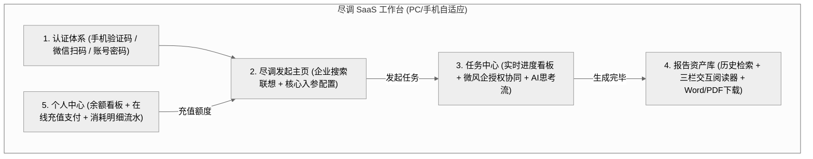
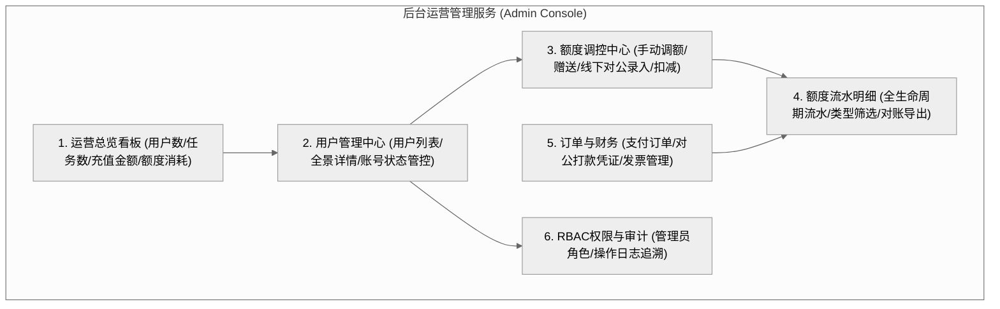
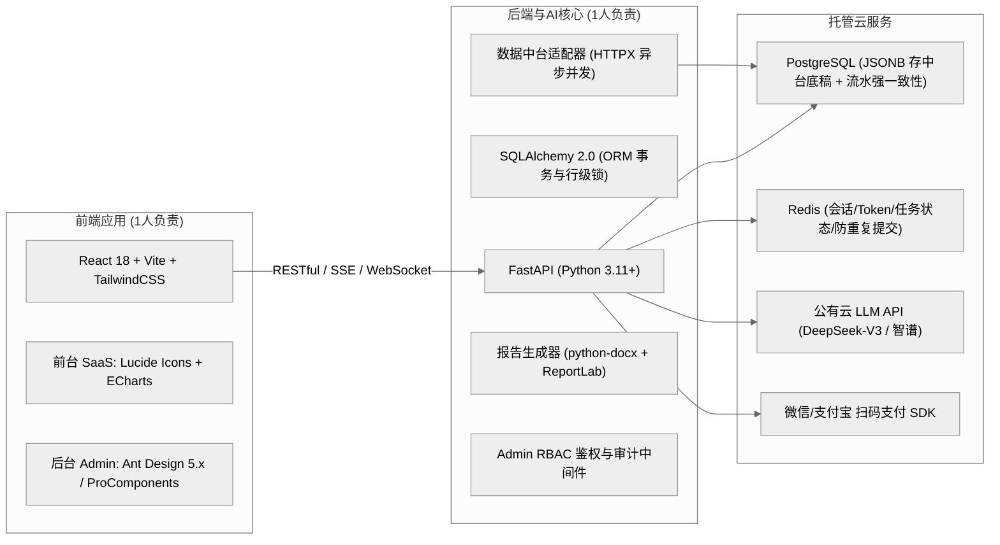

# 企业尽调系统 (EDD AI Platform) - 需求规格说明书 (PRD)

> **版本**：v2.1 (宣传官网、尽调 SaaS 工作台、后台运营管理服务全面定稿)  
> **更新时间**：2026-08-25  
> **状态**：定稿中，进入技术方案与研发准备  

---

## 1. 项目背景与商业模式

### 1.1 项目定位
面向中小微企业信贷审批、供应链客户/供应商准入审查等场景的 **轻量化商业 SaaS 尽调平台**。
平台由三大核心服务组成：
1. **宣传营销官网 (Marketing Portal)**：采用类 DeepSeek 极简高端科技风，面向公网获客与产品价值展示，引导用户注册体验。
2. **尽调 SaaS 工作台 (SaaS Workspace)**：全端自适应（PC 宽屏工作台 + 手机移动端便捷交互），提供一键发起 AI 尽调、微风企授权协同、实时任务跟踪、历史报告资产交互预览及额度充值流水管理。
3. **后台运营管理服务 (Admin Management Console)**：专供平台运营、客服、风控与财务人员使用，提供注册用户全景详情透视、额度人工精准控制与发放、额度全生命周期流水明细对账、订单审核与全站高危操作审计。

### 1.2 商业模式与计费逻辑
- **账户模式**：注册即送初始额度（如赠送 1~2 次免费完整尽调体验）。
- **额度充值机制**：
  - **按次计费 / 点数加油包**：例如购买 10次（¥880）、50次（¥3800）等阶梯额度包。
  - **扣费点**：成功拉取中台数据 + 微风企税务/多头数据并触发 AI 生成后扣除 1 次额度（支持失败自动返还）。
  - **支付方式**：支持微信支付、支付宝扫码支付，提供对公转账与企业专属开票申请。
- **极简工作流**：自助免审批工具化工作流（发起任务 -> 授权拉取 -> AI生成 -> 交互查看/导出报告）。

---

## 2. 宣传营销官网规格 (DeepSeek 风格)

### 2.1 视觉风格与设计语言
- **整体基调**：参考 DeepSeek 极简、现代、高科技质感，深浅色自适应，温润高级底色搭配微妙科技光晕（Glow & Glassmorphism）。
- **排版排版**：大字号清晰层级（Headline）、高对比度内容呈现、精细微胶囊标签（Pills）。
- **动效体验**：悬浮轻微抬升（Hover Lift）、流光描边（Border Beam）、核心指标平滑数字滚动。

### 2.2 官网页面模块规划
1. **顶部导航 (Navbar)**：
   - Logo + 品牌 Slogan
   - 核心锚点：产品特性、报告样本演示、价格方案、API 开放、合规安全
   - 右侧操作区：【登录】（幽灵按钮） + 【免费体验】（高亮主按钮，直跳注册赠送额度）
2. **Hero 核心首屏**：
   - 强有力价值主张：“新一代 AI 驱动的企业深度尽调引擎”。
   - 辅标：“一键聚合税务真实性、多头借贷与工商司法，60秒生成信贷风控级尽调研判”。
   - **交互式搜索体验组件**：支持直接输入企业名称体验实时模拟解析流程，一键转化引导注册。
3. **核心特性矩阵 (Feature Grid)**：
   - **税务真实营收透视**：近 24 个月断票检测、突击开票与季节性波动预警。
   - **多头借贷与共债雷达**：全网金融机构查询频次与共债压力评估。
   - **一票否决风控红黄牌**：严重失信、司法拍卖、实控人变更秒级判定。
   - **双向数据穿透溯源**：AI 评述每句关键财务结论均支持点击回溯原始底稿。
4. **交互式尽调报告样本 (Live Interactive Demo)**：
   - 内嵌交互式报告看板样本，允许潜在客户在无需登录的情况下体验报告交互阅读器。
5. **定价与套餐方案 (Pricing Plans)**：
   - 新手体验包（0元赠送 2 次）、标准加油包（10次）、企业特惠包（50次）、大客户 API 定制。
6. **底栏 (Footer)**：
   - 数据合规说明（持牌合规授权、数据不出域安全防护）、ICP 备案、用户协议、隐私政策与联系客服。

---

## 3. 尽调 SaaS 工作台与用户功能规格

### 3.1 认证与账户中心
- **全端支持**：PC 宽屏 + 手机移动端 H5 响应式自适应。
- **登录方式**：
  - 手机号 + 短信验证码快速注册/免密登录（默认主推）。
  - 微信扫码快捷登录（PC 端展示二维码 / 微信移动端内一键授权登录）。
  - 账号密码登录（支持找回密码）。
- **会话与权限**：采用 JWT Token 鉴权，支持 Token 自动刷新与路由守卫拦截。

### 3.2 功能模块一：AI 尽调发起主页 (DD Home)
- **企业核心搜索框**：
  - 支持输入企业全称或 18 位统一社会信用代码。
  - **实时模糊联想补全**：输入 2 个字以上即请求中台 `企业搜索` 接口，下拉展示企业全称、法人代表、省市地区，点击即自动填入，防止错字。
- **尽调入参配置面板**：
  - **尽调场景模板**：【银行信贷审批标准】 / 【供应链客户/供应商准入】 / 【极简工商风险排查】。
  - **分析维度选择**（默认全选）：工商股权穿透、经营司法合规、税务真实性与营收质量、多头借贷排查、资产抵质押风险。
  - **微风企税务授权模式**：
    - `立即生成授权码`：发起后生成微风企专属二维码/链接，待企业法人授权后拉取税务+多头数据。
    - `仅公开数据`：跳过税务授权，仅基于中台工商涉诉数据生成简版尽调报告。
  - **交付形式**：在线交互看板（必选）、自动排版导出 Word (.docx)、PDF。
- **额度校验与一键发起**：
  - 实时显示当前账号剩余额度与本次预计消耗。
  - 额度不足时点击自动唤起【快捷充值弹窗】，支付成功后无需重新录入直接发起。

### 3.3 功能模块二：实时进行中任务中心 (Task Center)
针对由于**等待法人授权扫码**或 **AI 大模型分析（耗时约 30~90 秒）** 产生的时间差，提供全流程可视化跟踪：
- **任务状态看板**：
  - 状态流转：`等待法人授权` -> `数据拉取与清洗中` -> `AI智能体分析研判中` -> `报告排版生成完成` / `异常终止`。
- **微风企法人授权协同交互**：
  - 任务卡片内置【微风企法人授权】专属区域：
    - 展示授权二维码，支持一键长按/保存。
    - 提供【一键复制授权链接】与【微信一键转发卡片】（移动端）。
    - 界面提供【刷新授权状态】按钮，同时后端采用 Webhook + 轮询自动检测授权结果。
- **AI 实时思考流与进度展示 (Thinking Logs)**：
  - 类似 DeepSeek 思考流，以展开折叠面板展示实时分析日志（例如：`[10:30] 已完成工商18项数据清洗` -> `[10:45] 规则引擎检出近6个月开票下滑32%，正在交叉比对多头负债`）。
- **任务操作**：支持查看详情、重新发起、取消任务、异常重试。任务完成后支持一键点击直接打开报告。

### 3.4 功能模块三：历史报告资产中心 (Report Assets)
- **报告检索与多维筛选**：
  - 按目标企业名称、统一信用代码搜索。
  - 按风控评级筛选：`🟢 建议准入` / `🟡 审慎关注(附条件)` / `🔴 一票否决(高危)`。
  - 按尽调时间范围、经办人进行筛选。
- **报告卡片/列表视图**：
  - 企业基本信息、综合评分/红黄牌标签、参考授信额度测算区间、生成时间。
  - 快捷操作：`【在线交互阅读】` `【下载 Word】` `【下载 PDF】` `【复制加密分享外链】`。
- **在线交互式报告阅读器 (Report Reader)**：
  - **三栏式宽屏布局 (PC)** / **流动折叠排版 (Mobile)**：
    - **左侧**：报告大纲目录（点击平滑滚动锚点）。
    - **中间**：核心报告看板（包含风控红黄牌一览表、税务营收 ECharts 趋势图、上下游集中度图谱、AI 综合风控结论）。
    - **右侧**：**数据底稿双向溯源面板**（点击中间报告中任意关键数据如“2025年开票收入 2400万元”，右侧面板即刻高亮展示微风企原始申报明细底稿）。

### 3.5 功能模块四：个人中心与账务中心 (User & Billing)
- **账户基本信息**：手机号、绑定微信、所属机构/企业名称、账户创建时间。
- **额度看板**：
  - 剩余可用次数展示（高亮大数字卡片）。
  - 累计已生成报告总数、累计消费次数。
- **在线充值中心**：
  - 套餐卡片选择：
    - 体验单次包：¥ 99 / 1次
    - 进阶加油包：¥ 880 / 10次（热门推荐）
    - 企业特惠包：¥ 3800 / 50次
  - **扫码支付弹窗**：集成微信/支付宝聚合收款码，页面轮询支付状态，支付成功即刻更新额度。
  - **企业对公转账**：提供对公账户信息与人工客服充值激活码兑换入口。
- **使用流水与明细 (Billing Logs)**：
  - **消耗流水**：记录每次尽调消耗的时间、任务 ID、目标企业名称、消耗点数（-1次）、报告查看入口。
  - **充值记录**：订单号、支付时间、支付金额、充值点数（+10次）、发票申请入口。

---

## 4. 后台运营管理服务规格 (Admin Management Console)

### 4.1 核心定位与 RBAC 权限体系
后台运营管理服务面向平台超级管理员、运营专员、客服与财务人员，通过统一的 RBAC (Role-Based Access Control) 角色权限体系进行严格访问控制与隔离：
- **超级管理员 (Super Admin)**：全站最高权限，包括管理员账号授权、全局额度策略配置、全量用户管理、大额人工调额与系统配置。
- **运营专员 / 主管 (Operations)**：查看注册用户详情、管理用户状态（冻结/解冻）、额度人工赠送/充值录入、尽调任务追踪与客户标签管理。
- **客服人员 (Support)**：查看用户基础信息、小额客诉补偿调额（单次 $\le 2$ 次）、尽调任务异常排查与重试。
- **财务管理员 (Finance)**：查看并审核线上支付订单、线下对公打款凭证、额度全生命周期流水对账及增值税发票开具。

### 4.2 功能模块一：注册用户全景管理与详情看板 (User 360° Profile)
- **用户列表与高级组合检索**：
  - **检索条件**：支持按用户手机号、用户 UID、绑定微信昵称、所属企业/机构、注册时间区间、账户状态（正常 / 冻结 / 限制使用）、剩余额度区间、近30天尽调活跃度等复合检索。
  - **数据呈现**：UID、用户主体（手机号/微信/认证企业）、总充值金额、当前剩余可用额度、已完成尽调任务数、账户状态标签、注册时间、最后活跃时间与快捷操作栏。
  - **批量与导出**：支持批量导出用户清单（Excel/CSV）、批量打标签（如 `重点大客户`、`渠道商`、`测试账户`、`异常风险`）。
- **用户全景详情抽屉/页面 (User Profile Details)**：
  - **基础身份与终端档案**：用户 UID、手机号、微信 OpenID/UnionID、实名企业认证信息（统一信用代码、营业执照）、注册来源、注册 IP 及物理归属地、最后登录设备与最后访问时间。
  - **资产与额度概览卡片**：
    - 当前可用额度（高亮大字）。
    - 累计充值额度、累计赠送额度、累计尽调消耗额度、异常失败返还额度。
    - 快速调额触发按钮【手动调额】。
  - **关联历史尽调任务穿透**：
    - 列表展示该用户发起的全部尽调任务（任务ID、目标企业名称、尽调评级、生成耗时、额度扣费状态、生成时间）。
    - 管理员支持一键点击直接打开在线报告或下载原始底稿排查问题。
  - **账户状态管控与操作**：
    - **一键冻结 / 解冻账户**：冻结后用户无法登录或无法发起新尽调任务（需填写冻结原因）。
    - **重置密码**：支持生成临时随机密码并短信通知用户。
    - **客户跟进记录与内部备忘**：运营人员可添加跟进记录（记录人、时间戳、沟通摘要），便于团队协同。

### 4.3 功能模块二：额度管控与人工调额中心 (Quota Management & Adjustment)
- **手动调额机制与凭证闭环**：
  - **操作触发**：用户详情页【调整额度】弹窗，或额度管理列表操作区。
  - **调额模式**：
    - `增加额度`（+N 次）：用于线下对公转账手工入账、商务合作赠送、客诉补偿等。
    - `减少额度`（-N 次）：用于误充值核减、违规撤回等（扣减上限为当前可用额度，不允许扣成负数）。
    - `重置为指定额度`（=N 次）：直接修正至目标数值。
  - **必填风控审计字段（防作弊/防私自放额）**：
    - **调额原因分类（下拉必选）**：`线下对公打款入账` / `商务合作赠送` / `新客体验增补` / `系统故障客诉补偿` / `误操作调账核减` / `内部测试`。
    - **关联凭据/单号**：如对公银行流水号、合同编号、工单编号、打款水单附件上传。
    - **操作备注说明**：不少于 5 个字的详细背景说明。
    - **二次安全确认**：展示 `变动前额度` $\rightarrow$ `变动后额度` 的醒目 Diff 确认对话框。
- **全局额度策略配置**：
  - 新注册用户默认赠送体验额度（默认 2 次，支持后台随时热更生效）。
  - 用户端额度不足预警阈值配置（当剩余 $\le 1$ 次时，在 SaaS 端突出显示充值引导）。

### 4.4 功能模块三：全生命周期额度流水与财务对账 (Quota Transactions & Audit Trail)
系统对每一笔额度的产生、消耗、冻结、释放、返还及人工调整均生成不可篡改的全局流水台账：
- **流水核心数据结构**：
  | 字段 | 说明 | 示例 |
  | :--- | :--- | :--- |
  | **流水单号 (TxID)** | 全局唯一自增/雪花ID，前缀区分业务 | `QTX2026082500001` |
  | **用户标识** | 用户 UID、手机号与企业主体 | `UID-88201 (138****8888)` |
  | **变动业务类型** | 精确业务场景分类 | `发起尽调扣费` / `线上充值增加` / `线下对公人工加额` / `注册系统赠送` / `任务失败自动返还` / `管理员人工扣减` |
  | **变动点数** | 增加为正数，扣减为负数 | `-1` / `+10` / `+50` |
  | **变动前后余额** | 记录变动基准与核对线 | 变动前: `5` $\rightarrow$ 变动后: `4` |
  | **关联业务单号** | 双向追溯业务源头 | 尽调任务ID `TSK-1092` / 支付订单号 `ORD-8873` / 调额工单 `ADJ-201` |
  | **操作主体** | 系统自动触发 或 经办管理员姓名/工号 | `SYSTEM` 或 `Admin-张运营 (ID: 1002)` |
  | **操作时间与 IP** | 精确到毫秒，附带客户端 IP | `2026-08-25 14:20:05.123` / `114.88.x.x` |
  | **备注说明** | 业务摘要或调额凭证摘要 | `发起企业【腾讯科技】尽调扣减 1 次` |

- **多维过滤与财务导出**：
  - 按时间周期（今日/昨日/近7天/本月/自定义范围）快速对账。
  - 按变动类型统计汇总点数总增量与总消耗量。
  - 支持一键导出标准 Excel / CSV 财务对账报表。

### 4.5 功能模块四：订单与财务发票管理 (Order & Invoicing)
- **线上支付订单管理**：展示微信/支付宝所有在线交易流水（平台订单号、第三方交易流水号、用户手机号、套餐金额、购买次数、支付状态、支付完成时间）。
- **线下对公打款审核**：大客户线下转账汇款凭证登记与核销，审核通过后自动触发额度充值与流水生成。
- **发票开具管理**：处理用户在 SaaS 前台提交的增值税普通发票/专用发票申请，支持标记状态（待开票 / 已开票 / 已邮寄）并回填电子发票 PDF 链接及发票代码。

### 4.6 功能模块五：高危操作审计日志 (Admin Operation Audit Logs)
- 自动化拦截并记录所有管理员的敏感操作（管理员登录、查看用户敏感信息、修改用户状态、人工调额、重置密码、导出数据）。
- 记录管理员身份、模块、操作动作、变更前后 Diff 镜像、访问 IP、User-Agent 及时间戳，提供安全合规追溯。

---

## 5. 终端与自适应适配设计规范 (PC vs Mobile)

| 页面/模块 | PC 端呈现规范 (宽屏高效工作台) | 移动端/微信 H5 呈现规范 (便捷触控与协同) |
| :--- | :--- | :--- |
| **整体布局** | 顶部固定 Navbar + 主体内容居中/侧边栏展开 | 顶部紧凑 Header + 汉堡抽屉菜单 + 底部 Tabbar |
| **尽调发起** | 宽幅搜索框 + 水平展开式参数配置卡片 | 竖向单列流式卡片，大按钮便于单手点击 |
| **微风企授权** | 弹窗展示高清晰大二维码 + 复制链接按钮 | **一键调用微信分享给企业法人** / 长按识别二维码 |
| **进行中任务** | 多列网格卡片 + 悬浮实时日志抽屉 | 单列折叠卡片 + 阶段步骤条（Steps） |
| **报告阅读器** | 三栏常驻（目录导航 + 报告内容 + 底稿溯源） | 单栏平铺阅读 + 悬浮浮动目录与导出底部栏 |
| **额度充值** | 弹窗展示微信/支付宝原生扫码支付 | 调起移动端微信/支付宝 H5 支付 或 扫码图片保存 |
| **后台管理 (Admin)** | 侧边栏多级导航 + 宽屏响应式表格与抽屉 | 响应式自适应折叠表格，支持移动端随时查看用户与审核 |

---

## 6. 数据接入层（数据中台清单）

### 6.1 基础与关联图谱接口
- **企业工商基本信息**（含联系方式、曾用名、企业搜索、纳税人识别号）
- **变更与历史股东**（变更记录、企业公示-股权变更、历史股东信息）
- **股权与穿透**（股东信息、对外投资、疑似实际控制人）

### 6.2 经营合规与抵质押接口
- **合规与处罚**：经营异常、严重违法、行政处罚、环保处罚、清算信息、简易注销
- **资产与抵质押**：股权出质、质押比例、质押明细详情、动产抵押、土地抵押/详情、知识产权出质、司法拍卖

### 6.3 微风企税务与信贷数据接口 (重点核心)
- **授权管理**：`授权链接获取`（生成企业法人微风企授权二维码/H5链接）
- **税务合并数据**：`税务合并`、`税务影像资料`（发票进销项明细、申报表、税负率等）
- **信贷多头与贷前**：`多头统计`（多平台借贷与查询频次）、`贷前报告`、`贷前报告 PDF`

---

## 7. AI 核心分析与指标引擎

| 分析维度 | 具体规则与 AI 研判逻辑 |
| :--- | :--- |
| **真实营收与开票健康度** | 统计近 12/24 个月开票总额、同比/环比增速；自动识别断票月份、突击开票异常；分析主要开票商品品目与主营业务匹配度。 |
| **上下游与集中度** | 提炼前 5/10 大开票客户与供应商，测算集中度占比，排查关联方交易与单一客户依赖风险。 |
| **负债与多头借贷** | 分析近 1/3/6/12 个月金融机构查询频次，评估共债压力与资金链紧绷度。 |
| **资产过度质押排查** | 汇总动产抵押、土地抵押与股权质押综合情况，评估资产重抵率。 |
| **风控红黄牌一览** | **红牌(一票否决)**：列入失信、严重违法、涉案拍卖；**黄牌(关注疑点)**：开票骤降>30%、实控人近期频繁变更、高负债查询。 |
| **建议额度与准入结论** | 综合税务流水、抗风险能力，AI 给出风控准入建议（通过/附条件/拒绝）及参考授信测算额度。 |

---

## 8. 2人团队专属极简技术架构方案

### 8.1 完整工程路由结构规划

#### 宣传官网与 SaaS 前台路由
- `/`：宣传营销官网首页 (DeepSeek 极简科技风)
- `/pricing`：定价与套餐详情页
- `/auth/login`：登录/注册/手机验证码认证页（支持弹窗或独立页面）
- `/app`：尽调工作台主页（企业联想搜索与尽调发起）
- `/app/tasks`：实时进行中尽调任务跟踪中心
- `/app/reports`：历史尽调报告资产库
- `/app/reports/:id`：报告在线交互式阅读器（三栏布局、ECharts图表、底稿溯源）
- `/app/user/profile`：个人中心（基本信息）
- `/app/user/billing`：额度看板与在线充值
- `/app/user/history`：额度消费流水与充值明细

#### 后台运营管理服务路由 (`/admin/*`)
- `/admin/login`：管理员独立登录页
- `/admin/dashboard`：运营大盘与核心指标总览
- `/admin/users`：注册用户列表与全景检索
- `/admin/users/:id`：用户 360° 详情画像与历史任务
- `/admin/quota/adjust`：额度人工调控与赠送管理
- `/admin/quota/transactions`：额度全生命周期流水明细与对账导出
- `/admin/orders`：线上支付订单与线下对公转账审核
- `/admin/invoices`：用户开票申请管理
- `/admin/system/admins`：RBAC 角色与管理员账号配置
- `/admin/system/audit-logs`：全站高危操作审计日志

---

## 9. 下一步工作规划与研发里程碑

- [x] **Milestone 1**: 业务需求规格说明书 (PRD v2.1) 定稿，宣传官网、SaaS工作台与后台管理服务三大服务规范全面对齐。
- [x] **Milestone 2**: 零依赖本地轻量版（SQLite + MemoryCache + Mock中台底稿）FastAPI 后端与 React 18 前端极简开发环境搭建完毕。
- [x] **Milestone 3**: 尽调工作台核心链路开发（发起尽调主页、进行中任务看板、微风企授权协同流、历史报告阅读器）。
- [x] **Milestone 4**: 后台管理服务开发（用户列表与详情抽屉、额度人工调控弹窗、额度流水明细与对账导出）。
- [x] **Milestone 5**: 个人中心额度充值（微信/支付宝支付）与消费流水模块联调。
- [ ] **Milestone 6**: 后端接入真实中台接口、微风企生产授权回调与云端 PostgreSQL/Redis 部署。
