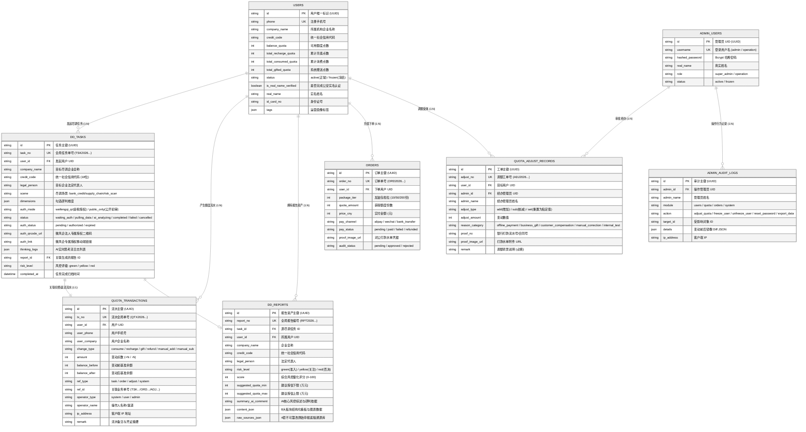

# 享宇智评尽调平台 (EDD AI Platform) - 实际代码实现架构全景文档

> **版本**：v2.1 (Full Implemented Codebase)  
> **文档性质**：基于工程当前实际落地代码（FastAPI + React 18 + SQLAlchemy 2.0 + SQLite/PostgreSQL）的 1:1 真实架构全景剖析  
> **更新时间**：2026-08-28  

---

## 1. 实际落地架构全景总览 (Implemented Architecture Blueprint)

根据代码库现有的真实实现，系统由 **前端应用层 (React 18 SPA)**、**API 网关与路由层 (FastAPI)**、**核心领域服务层 (Domain Services)**、**三方数据适配器层 (Adapter Providers)** 以及 **数据持久化与安全审计层** 构成：

```mermaid
%%{init: {'theme': 'neutral', 'themeVariables': { 'primaryColor': '#f8fafc', 'primaryTextColor': '#0f172a', 'primaryBorderColor': '#94a3b8', 'lineColor': '#475569', 'secondaryColor': '#f1f5f9', 'tertiaryColor': '#ffffff' }}}%%
graph TB
    subgraph ClientLayer ["1. 前端展现层 (React 18 + Vite 5 + AntD 5 + TailwindCSS)"]
        Portal["🌐 营销官网 (HomePage.jsx)<br/>• 动态企业模糊联想搜索<br/>• 报告全景三栏交互 Demo"]
        SaaS["💻 SaaS 尽调工作台<br/>• DDHomePage: 发起任务与维度配置<br/>• TaskCenterPage: 任务流与实时思考日志<br/>• ReportReaderPage: 三栏穿透与Canvas PDF<br/>• UserCenterPage: 实名核验与额度管理<br/>• UserBillingPage: 加油包与对公转账"]
        Admin["🛡️ 后台运营控制台<br/>• AdminDashboardPage: 运营财务大盘<br/>• AdminUsersPage: 360°用户画像与管控<br/>• AdminQuotaPage: 额度流水台账与调额工单<br/>• AdminOrdersPage: 线下对公订单审核"]
    end

    subgraph APILayer ["2. API 接口与鉴权网关层 (FastAPI 异步架构)"]
        direction TB
        V1_Router["前台 SaaS 路由 (/api/v1)<br/>• auth.py (短信/密码/实名认证送额度)<br/>• search.py (中台企业模糊匹配)<br/>• tasks.py (发起尽调/异步驱动/授权回调)<br/>• reports.py (报告调阅/底稿穿透/导出)<br/>• billing.py (额度流水/加油包下单)"]
        Admin_Router["后台 Admin 路由 (/api/admin)<br/>• auth.py (管理员认证鉴权)<br/>• dashboard.py (运营与风控指标统计)<br/>• users.py (用户列表/画像/冻结/重置)<br/>• quota.py (全局流水/人工带凭据调额)<br/>• orders.py (订单审核与对公核销)"]
        SecMiddleware["安全与控制<br/>• CORS 跨域放行 • 双 JWT 体系 (User/Admin 依赖注入) • Pydantic 校验 • 异常统一拦截"]
    end

    subgraph ServiceLayer ["3. 核心领域与计算引擎层 (Domain Services)"]
        TaskSvc["⚙️ 尽调任务流水线 (TaskService)<br/>• 异步状态机调度 (waiting_auth -> pulling_data -> ai_analyzing -> completed)<br/>• 动态追加 AI 思考流日志 (thinking_logs)<br/>• 模式路由 (公开初审 public_only vs 金税全景)"]
        CleansingSvc["🔬 工业级清洗与风控引擎 (DataCleansingService)<br/>• Stage 1: 最高准据原则 (Golden Source) 冲突裁决<br/>• Stage 2: 5 维特征工程网格 (26 个子规则推理)<br/>• Stage 3: 5 大一票否决红线熔断 + 享宇智评分 (900/100分双轨制)<br/>• Stage 4/5: 8 大全景报告板块 (content_json) + 4 套原始底稿 (raw_sources_json)"]
        QuotaSvc["💰 额度强一致性服务 (QuotaService)<br/>• SELECT ... FOR UPDATE 行级锁原子事务<br/>• 尽调扣费 (-1次) / 失败异常反向补偿 (+1次)<br/>• 人工精准调额工单 (带打款凭证与流水号)"]
    end

    subgraph ProviderLayer ["4. 多源数据适配器层 (Adapter 模式)"]
        WFQ["WeifengqiProvider<br/>近24/36个月增值税申报表/断票分析/销项开票流水/下游集中度/水电运费拟合"]
        IC["ICDataProvider<br/>工商基本面/实缴资本与新公司法5年评估/股东穿透/董监高/变更轨迹"]
        Risk["RiskRadarProvider<br/>司法涉诉/失信被执行人一票否决/行政处罚/全网金融机构多头借贷征信"]
    end

    subgraph StorageLayer ["5. 数据持久化与基础设施层"]
        DB[(关系型数据库<br/>• 本地开发: 内置 SQLite3 (edd_dev.db)<br/>• 生产环境: PostgreSQL + asyncpg<br/>• ORM: SQLAlchemy 2.0 声明式 Mapped)]
        SeedData[(自动预置测试数据<br/>• 超级管理员: admin / admin123<br/>• 演示企业用户: 13800138000 (12次额度)<br/>• 预置腾讯科技全景尽调报告 & 4条流水)]
    end

    ClientLayer --> APILayer
    APILayer --> ServiceLayer
    ServiceLayer --> ProviderLayer
    ServiceLayer --> StorageLayer
    ProviderLayer --> StorageLayer
```

---

## 2. 后端真实代码模块与分层设计

后端项目位于 [`backend/`](file:///c:/Users/ZzzLee/Desktop/edd-ai-platform%20v2/backend)，核心代码目录结构与职责如下：

```
backend/
├── main.py                    # FastAPI 启动入口、CORS 中间件配置、路由注册、lifespan 自动初始化数据库
├── app/
│   ├── core/                  # 核心基础设施
│   │   ├── config.py          # 基于 Pydantic BaseSettings 的全局配置（读取 .env）
│   │   ├── database.py        # SQLAlchemy 2.0 异步引擎、AsyncSessionLocal、init_db() 种子数据注入
│   │   ├── security.py        # Passlib bcrypt 密码哈希、JWT Access Token 签发与解析
│   │   └── cache.py           # 内存缓存 MemoryCache 与 RedisCache 抽象池
│   ├── models/                # SQLAlchemy ORM 数据库实体模型 (全类型声明 Mapped)
│   │   ├── base.py            # Base 声明基类、TimestampMixin (created_at, updated_at)
│   │   ├── user.py            # User 用户表 (手机号、企业名、额度余额、实名状态、标签)
│   │   ├── admin.py           # AdminUser 管理员表 (用户名、角色: super_admin/operation)
│   │   ├── task.py            # DDTask 尽调任务过程态表 (状态机、微风企二维码、AI 思考流日志)
│   │   ├── report.py          # DDReport 尽调报告终态资产表 (content_json, raw_sources_json)
│   │   ├── quota.py           # QuotaTransaction (不可篡改额度流水), QuotaAdjustRecord (调额工单)
│   │   ├── order.py           # Order 加油包充值与线下对公转账订单表
│   │   └── audit.py           # AdminAuditLog 管理员高危操作安全审计日志表
│   ├── schemas/               # Pydantic 入参/出参数据校验模型
│   │   ├── auth.py            # 注册/登录/实名/Token 响应 Schema
│   │   ├── task.py            # 创建任务、任务详情 Schema
│   │   ├── billing.py         # 订单创建、流水明细 Schema
│   │   └── user.py            # 用户更新 Schema
│   ├── api/                   # RESTful API 控制器层
│   │   ├── deps.py            # 依赖注入 (get_db, get_current_user, get_current_admin)
│   │   ├── v1/                # 前台 SaaS 业务接口
│   │   │   ├── auth.py        # 用户登录/验证码/公安实名认证 (实名成功自动赠送1次免费额度)
│   │   │   ├── search.py      # 企业工商实时联想模糊检索接口
│   │   │   ├── tasks.py       # 发起尽调任务 (触发原子扣费)、任务列表/详情、授权回调
│   │   │   ├── reports.py     # 获取报告详情、三方底稿、PDF导出
│   │   │   └── billing.py     # 额度查询、个人流水台账、加油包下单与对公打款凭证上传
│   │   └── admin/             # 后台管理接口
│   │       ├── auth.py        # 管理员登录与当前身份获取
│   │       ├── dashboard.py   # 全站用户数、报告数、消耗额度、GMV与风控分布统计
│   │       ├── users.py       # 用户 360° 列表与详情、冻结/解冻、重置密码
│   │       ├── quota.py       # 全局不可篡改流水台账、人工带凭据调额 (add/sub/set)
│   │       └── orders.py      # 加油包订单列表、线下打款凭据审核确认
│   ├── services/              # 核心业务与领域逻辑层
│   │   ├── cleansing_service.py # [核心计算引擎] DataCleansingService (747行工业级清洗计算规则)
│   │   ├── task_service.py    # [任务流水线] TaskService 驱动三方拉取、状态迁移与思考日志
│   │   └── quota_service.py   # [财务级事务] QuotaService 原子扣减、失败返还与调额审计
│   ├── providers/             # 三方数据源适配器 (Adapter 模式)
│   │   ├── base.py            # BaseProvider 抽象基类 (HTTP 客户端、鉴权、重试)
│   │   ├── weifengqi_provider.py # 微风企/金税数据中台接口适配器
│   │   ├── ic_provider.py     # 企业工商与股权穿透数据适配器
│   │   └── risk_provider.py   # 经营风险雷达与全网多头借贷数据适配器
│   └── mock/                  # 拟真多场景数据集 (绿色标杆/黄色关注/红色一票否决)
│       └── mock_data.py
```

---

## 3. 前端真实代码模块与页面路由设计

前端项目位于 [`frontend/`](file:///c:/Users/ZzzLee/Desktop/edd-ai-platform%20v2/frontend)，基于 React 18 + Vite 5 + TailwindCSS + Ant Design 5 构建：

### 3.1 前端路由拓扑 (`frontend/src/routes/AppRoutes.jsx`)

| 业务域 | 路由路径 | 对应前端组件 | 真实实现的核心能力 |
| :--- | :--- | :--- | :--- |
| **公网门户** | `/` | `pages/portal/HomePage.jsx` | 极简科技风 Hero、动态企业模糊联想搜索、交互式尽调 Demo 报告抽屉 |
| **用户认证** | `/auth/login` | `pages/auth/LoginPage.jsx` | 手机短信验证码 / 密码双模式登录，公安实名认证送 1 次额度横幅提示 |
| **后台认证** | `/admin/login` | `pages/admin/AdminLoginPage.jsx` | 管理后台账号密码鉴权入口 |
| **SaaS 工作台** | `/app` | `pages/saas/DDHomePage.jsx` | 企业智能联想录入、场景模板选择 (`bank_credit`/`supply_chain`/`risk_scan`)、研判维度勾选、公开初审与微风企金税授权模式切换 |
| **任务与报告** | `/app/tasks` | `pages/saas/TaskCenterPage.jsx` | 任务列表与状态看板、AI 实时思考流日志抽屉、微风企法人授权专属二维码弹窗 |
| **报告阅读器** | `/app/reports/:id` | `pages/saas/ReportReaderPage.jsx` | **三栏高保真阅读器**：<br/>1. 左侧大纲导航目录；<br/>2. 中间 8 大全景报告板块 (含 ECharts 趋势图)；<br/>3. 右侧双模抽屉 (AI 对话问答 + 4 套原始申报底稿双向高亮穿透)；<br/>4. **PDF 原生矢量 Canvas 流式渲染** (基于 `pdfjs-dist` 与单例 Promise 缓存池)。 |
| **个人与额度** | `/app/profile` | `pages/saas/UserCenterPage.jsx` | 个人公安实名认证弹窗、额度资产卡片、不可篡改变动流水明细、充值订单记录 |
| **充值加油包** | `/app/billing` | `pages/saas/UserBillingPage.jsx` | 纯份数阶梯加油包 (10/50/200份)、微信/支付宝扫码与对公打款凭单上传 |
| **管理大盘** | `/admin/dashboard` | `pages/admin/AdminDashboardPage.jsx` | 用户总数、报告总数、消耗额度、充值 GMV 统计卡片与风控评级分布图 |
| **用户管控** | `/admin/users` | `pages/admin/AdminUsersPage.jsx` | 用户 360° 画像透视、一键冻结/解冻、重置密码、额度变更轨迹查看 |
| **流水与调额** | `/admin/quota` | `pages/admin/AdminQuotaPage.jsx` | 全局不可篡改流水台账检索、人工精准调额工单 (支持 `add`/`sub`/`set`，必须附带打款流水号/凭证与原因) |
| **订单审核** | `/admin/orders` | `pages/admin/AdminOrdersPage.jsx` | 线下对公转账订单打款水单核验、审核通过自动核销到账 |

---

## 4. 核心计算引擎：DataCleansingService 工业级规则实现

位于 [`backend/app/services/cleansing_service.py`](file:///c:/Users/ZzzLee/Desktop/edd-ai-platform%20v2/backend/app/services/cleansing_service.py)，代码行数达 747 行，实现了全套金融级数据清洗与风控研判工作流：

### 4.1 五阶段清洗与推理流水线 (5 Stages)
1. **Stage 1: 最高准据原则 (Golden Source Principle) 数据冲突裁决与标准化**
   - 官方实时工商接口（P1 准据）覆盖陈旧登记；
   - 涉税与生产能耗（P2 金税中台准据）校验有效开票率与废票红冲率；
   - 司法涉诉与多头征信（P1 准据）提取失信、被执行、行政处罚明细。
2. **Stage 2: 5 维特征工程网格与 26 个子规则推理**
   - **工商基本面特征 (满分 20 分)**：注册资本实缴到位率、存续年限、实际控制人控制层级、历史变更频次、参保人数。
   - **经营合规特征 (满分 30 分)**：严重违法失信名单、经营异常名录、行政处罚与环保罚款、大股东股权质押、涉诉裁判与被告执行标的。
   - **金税质量特征 (满分 25 分)**：税务局官方纳税信用评级（A/B/C/D）、历史欠税与滞纳金、36个月连续申报矩阵（零申报排查）、行业税负率对标。
   - **流水稳定性与三费真实性 (满分 25 分)**：开票断票天数与断崖式下滑检测、**月度电费/水费/运费与开票走势强相关拟合**、开票离散系数、近 3 个月全网金融机构多头借贷查询频次。
   - **跨板块交叉研判网格 (6 组交叉特征)**：
     - 开票规模与注册资本勾稽匹配 (排查空壳平台)；
     - 税负合理性与股权质押联动 (排查大股东套现抽逃)；
     - 历史工商变更与营收斜率联动 (经营困境与代持预警)；
     - 水电燃气运费与开票强拟合 (排查买票虚开走账)；
     - 合规监管处罚与纳税评级联动 (双重合规红线排查)；
     - 核心客户集中度与多头借贷交叉排查 (账期垫资与流动性压力)。
3. **Stage 3: 5 大一票否决硬红线熔断机制与「享宇智评分」动态校准**
   - **5 大一票否决红线 (`RED-01` ~ `RED-05`)**：
     - `RED-01`: 列入严重违法失信企业名单（黑名单）；
     - `RED-02`: 失信被执行人且拒不履行生效判决；
     - `RED-03`: 经营异常名录未移出（地址失联/逾期年报）；
     - `RED-04`: 纳税信用评级 D 级（高危纳税人）；
     - `RED-05`: 重大涉税历史欠税未清缴（欠税 > 50 万元）。
   - **享宇智评分 (XY-SmartScore) 算法**：
     - 采用 **900 分制基准与 100 分制折算双轨体系**；
     - 细分五类八级信用等级：`A级 (820+)`、`B+级 (700-819)`、`B级 (640-699)`、`C+级 (580-639)`、`D级 (500-579)`、`E级 (一票否决熔断 / <500)`；
     - 输出量化授信建议区间（如 A 级标杆建议 800~1200 万元，E 级建议 0 元并触发风控预警）。
4. **Stage 4 & 5: 8 大全景报告板块 (`content_json`) 与 4 套不可篡改底稿库 (`raw_sources_json`) 输出**
   - 8 大全景业务板块：
     1. 企业基本工商照面与存续稳定性；
     2. 资本充实度与新《公司法》5年实缴合规评估；
     3. 股东穿透、实际控制人与关键管理人员治理；
     4. 司法涉诉、行政处罚与合规监管底稿穿透；
     5. 金税增值税申报、近 24 个月开票趋势与水电运费生产要素拟合；
     6. 上下游供应链集中度与核心客商生态；
     7. 全网金融机构多头借贷征信与共债压力；
     8. 享宇智评分模型、五类八级评级与贷前授信建议矩阵。
   - 4 套高保真不可篡改原始底稿溯源库：
     - `business_registration_summary` (官方数据中台工商底稿)；
     - `judiciary_risk_summary` (司法涉诉与行政处罚底稿)；
     - `tax_invoice_summary` (金税申报与发票流水存证底稿)；
     - `multi_lending_summary` (全网多头信贷排查底稿)。

---

## 5. 真实数据模型实体关系 (Database ER Architecture)

系统在 [`backend/app/models/`](file:///c:/Users/ZzzLee/Desktop/edd-ai-platform%20v2/backend/app/models) 中完整定义了 7 张核心业务表与 1 张审计表：



---

## 6. 核心业务全链路实现时序 (Real Implementation Flow)

```
[1. 模糊检索]
  User (前端输入 "腾讯") ──> GET /api/v1/search/companies?keyword=腾讯 ──> 返回工商照面与统一信用代码

[2. 发起尽调与原子扣额]
  User 点击【发起尽调】 ──> POST /api/v1/tasks (company_name, credit_code, auth_mode, scene)
  └── QuotaService.deduct_quota_for_task (行级锁 user.balance_quota - 1)
  └── 生成 QTX 扣费流水 ──> 插入 DDTask (status='waiting_auth') ──> 返回专属微风企授权二维码与 H5 链接

[3. 法人扫码签署授权]
  企业法人微信扫码 ──> POST /api/v1/tasks/{id}/auth_callback (或前端轮询)
  └── DDTask.auth_status 变为 'authorized', DDTask.status 变为 'pulling_data'
  └── 异步启动 TaskService.run_ai_dd_task_async(task_id)

[4. 异步三方数据拉取与思考流生成]
  TaskService 并发调用 Providers：
  ├── ICDataProvider.fetch_ic_full_profile ──> 追加思考日志："企业工商与股权穿透已获取"
  ├── WeifengqiProvider.fetch_tax_data (金税中台) ──> 追加思考日志："近36个月金税申报与开票流水已获取"
  └── RiskRadarProvider.fetch_risk_profile ──> 追加思考日志："司法裁判与多头借贷雷达扫描完毕"

[5. 触发工业级清洗引擎与智评分测算]
  DDTask.status 变为 'ai_analyzing'
  └── DataCleansingService.clean_and_synthesize (执行最高准据裁决、26条特征规则、5大红线检测、900/100双轨智评分、8大板块 content_json、4套底稿 raw_sources_json)

[6. 终态报告落库与交付]
  插入 DDReport (id, report_no, content_json, raw_sources_json)
  └── DDTask.status 变为 'completed', 关联 report_id
  └── User 在任务中心接收完成状态，点击进入三栏高保真阅读器 (支持 HTML5 Canvas PDF 矢量渲染与双向底稿穿透)
```

---

## 7. 架构特色与生产落地保障

1. **真实零代码修改平滑演进**：
   - 本地开发采用单文件 SQLite (`data/edd_dev.db`) + 内置 Mock 数据集 + 内存缓存抽象；
   - 生产部署时仅需配置 `backend/.env`：切换 `DATABASE_URL` 为 PostgreSQL，切换 `WEIFENGQI_MODE=http`、`IC_DATA_MODE=http`、`RISK_DATA_MODE=http` 为真实三方 HTTP 网关，**无需改动任何一行业务代码**。
2. **财务级强一致性与防篡改对账体系**：
   - 杜绝直接无凭据修改余额，所有额度消耗、充值、赠送、人工核减必须在 `with_for_update` 数据库事务中同步记录 `quota_transactions`；
   - 管理后台人工调额强制绑定 `quota_adjust_records` 工单号、银行打款流水号与凭证水单附件；
   - 管理员关键动作全量写入 `admin_audit_logs` 安全合规审计表。
3. **过程态与终态彻底解耦**：
   - 任务表 `dd_tasks` 专注记录**状态迁移、授权二维码、AI 思考流与异步轨迹**；
   - 报告表 `dd_reports` 专注保存**定稿看板（`content_json`）与不可篡改双向溯源证据链（`raw_sources_json`）**，确保存档报告具备永久法律存证与穿透对账效力。
4. **Canvas PDF 原生矢量流式渲染**：
   - 针对长达 60+ 页的尽调报告，前端采用 `pdfjs-dist` HTML5 Canvas 矢量流式渲染，结合全局单例 Promise 请求缓存池，彻底避免传统大图加载的内存溢出与重复请求问题。
