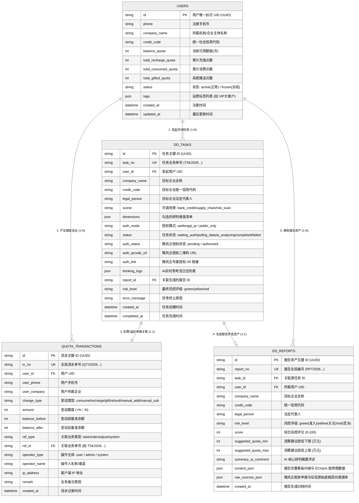
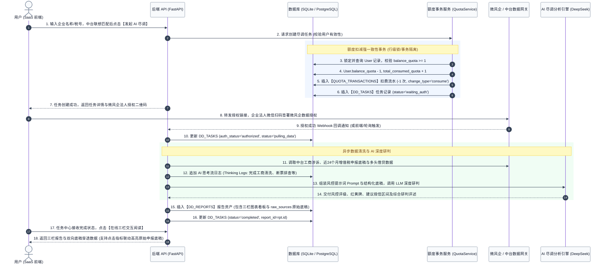
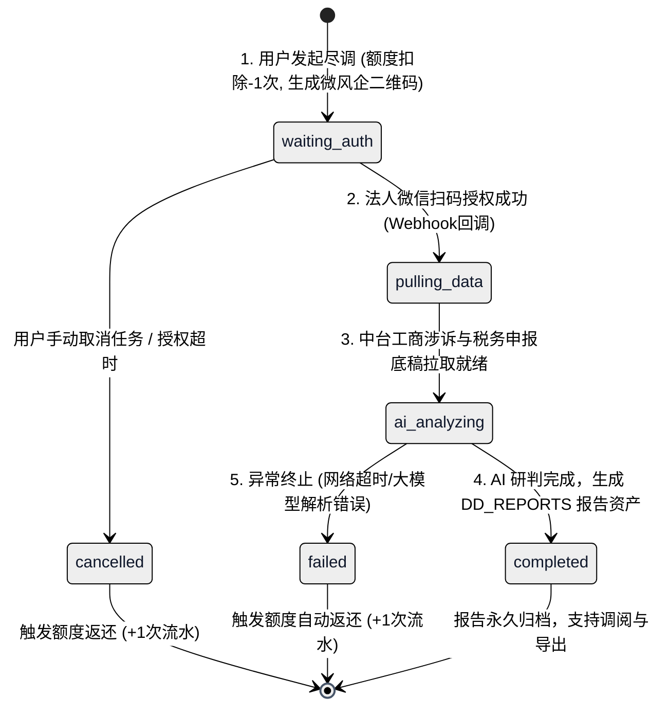

# 企业尽调系统 (EDD AI Platform) - 用户发起尽调任务场景 ER 图与业务主流程文档

> **版本**：v2.1  
> **文档主题**：用户发起 AI 尽调任务场景的核心数据实体关系 (ER)、业务时序流转与事务状态机规范 (浅色主题图表)  
> **更新时间**：2026-08-25  

---

## 1. 场景概述

“用户发起 AI 尽调”是平台 SaaS 业务的核心业务主线。该场景串联了：
1. **企业主体模糊检索**（中台工商涉诉数据匹配）
2. **账户额度校验与强一致性扣减**（生成不可篡改的消耗流水）
3. **微风企税务与信贷法人授权协同**（生成专属授权二维码/链接并异步接收回调）
4. **AI 智能体思考流分析**（结合工商、近24个月税务开票与多头征信进行推理）
5. **风控报告生成与资产归档**（交付三栏交互式看板与双向原始底稿溯源库）

---

## 2. 核心实体关系 ER 图 (Entity-Relationship Diagram)

---

## 3. 业务主流程时序图 (Sequence Diagram)

---

## 4. 尽调任务全生命周期状态机 (Task State Machine)

---

## 5. 核心字段与设计原则

### 5.1 额度资产强一致性保障
- **原子事务**：`User` 余额扣减与 `QUOTA_TRANSACTIONS` 流水生成在同一个数据库事务中执行。
- **自动逆向补偿机制**：在数据拉取（`pulling_data`）或 AI 研判（`ai_analyzing`）阶段若出现不可恢复的异常，调度服务自动触发反向补偿事务：
  - 任务状态标记为 `failed`；
  - 自动向 `QUOTA_TRANSACTIONS` 插入一条 `change_type='refund'`、`amount=+1` 的流水；
  - 将用户 `balance_quota` 恢复，并在备注中记录异常返还原因。

### 5.2 过程态与终态解耦
- **`DD_TASKS`（过程态）**：聚焦于记录**任务执行轨迹**（授权二维码状态、当前进行步骤、AI 思考流实时日志、生成耗时）。
- **`DD_REPORTS`（终态资产）**：聚焦于存储**完整的尽调成果与证据链**（基本信息、风控红黄牌清单、ECharts 开票营收趋势、下游集中度、以及右侧双向溯源底稿库 `raw_sources_json`）。
