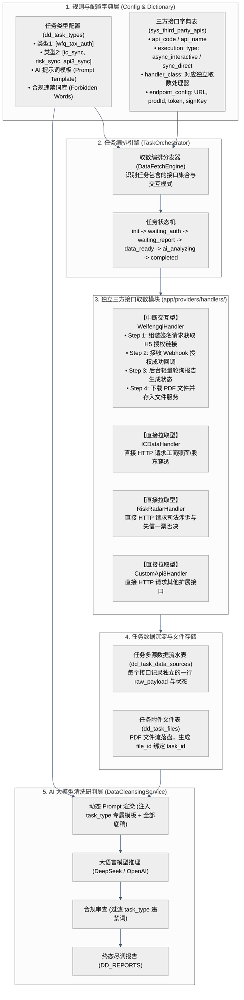
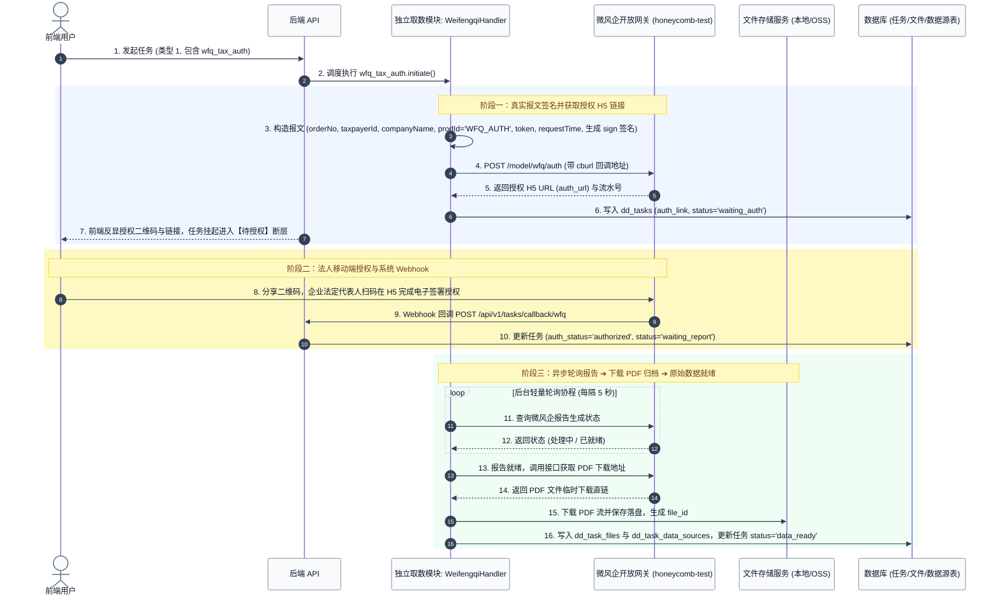
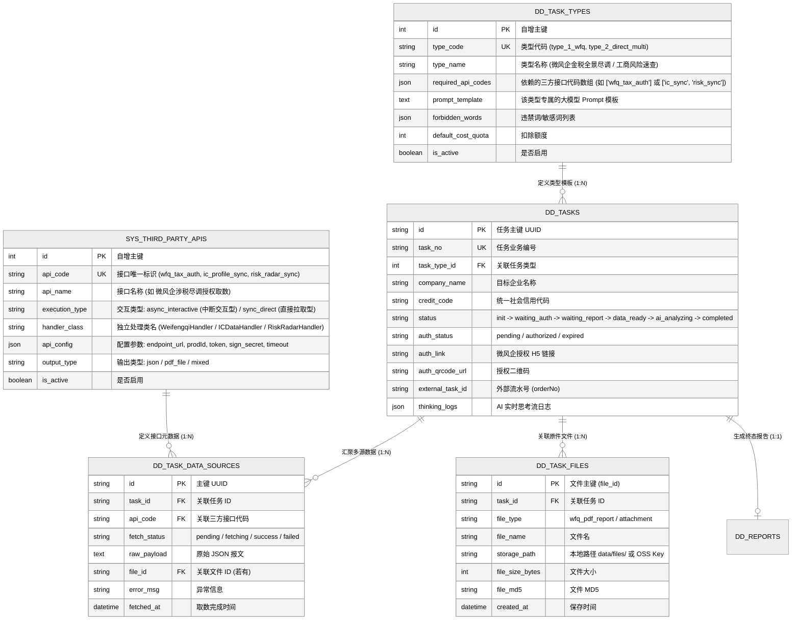

# 享宇智评尽调平台 (EDD AI Platform) - 任务多类型扩展、接口字典化与微风企取数全流程方案设计

> **版本**：v2.3 (Enhanced with API Dictionary & Dual Lifecycle Handlers)  
> **文档主题**：三方接口字典表管理、中断交互型 vs 直接拉取型双生命周期调度、微风企真实参数签名与授权闭环、独立取数模块架构设计  
> **更新时间**：2026-08-28  

---

## 1. 核心需求拆解与架构分层

### 1.1 业务特点与关键洞察
1. **三方接口字典化 (`sys_third_party_apis`)**：
   - 所有外部数据源在数据库中建立统一的**字典表**维护；
   - 字典表明确声明每个接口的 **取数交互模式（中断交互型 vs 直接拉取型）**、请求端点、鉴权参数及对应的底层独立取数 Handler 类。
2. **两类截然不同的取数生命周期**：
   - **模式 A：中断断层交互型 (`async_interactive`)**（如微风企）：
     - 存在人机交互断层：发起 ➔ 请求获取授权链接 ➔ 任务挂起并反显二维码 ➔ 用户在 H5 完成授权 ➔ Webhook 回调通知系统 ➔ 异步轮询报告生成 ➔ 下载 PDF 存入文件服务 ➔ 关联 `task_id`。
   - **模式 B：直接一次性拉取型 (`sync_direct`)**（如企业工商、司法风险雷达、中台API）：
     - 无需外部人工介入，系统发起即时 HTTP 调用，一次性获取 JSON 报文并直接落库，无需中断等待。
3. **任务类型配置与接口动态编排 (`dd_task_types`)**：
   - 「类型1」绑定微风企接口 `wfq_tax_auth`；
   - 「类型2」绑定一组直接拉取接口 `["ic_profile_sync", "risk_radar_sync", "custom_api_3"]`；
   - 「类型3（混合全景）」可同时勾选微风企与多个直接接口。
4. **独立取数模块与大模型消费隔离**：
   - 取数逻辑完全收口在独立的 `DataFetchEngine` + `ProviderHandlers` 模块中；
   - 所有取数结果最终汇总在 `dd_task_data_sources`（报文）和 `dd_task_files`（PDF/附件），为后续 AI 阶段提供统一的上下文。

---

## 2. 系统整体架构与调度分层 (Architecture Blueprint)



---

## 3. 双取数模式的生命周期与时序图

### 3.1 模式 A：微风企中断交互型时序 (Interactive Lifecycle)



### 3.2 模式 B：直接拉取型时序 (Direct Fetch Lifecycle)
对于工商、风险雷达、自定义 API 3 等不需要人工外部授权的接口：
```
[任务发起] ──> DataFetchEngine 识别为 sync_direct 
           ──> 并发调用 Handler.fetch_data() 
           ──> 立即获取 JSON 报文并写入 dd_task_data_sources 
           ──> 直接标记该数据源完成，无断层挂起
```

---

## 4. 数据库模型与表结构设计 (ER Schema)



### 4.1 SQL 表结构 DDL 定义

```sql
-- 1. 三方接口字典表
CREATE TABLE sys_third_party_apis (
    id INTEGER PRIMARY KEY AUTOINCREMENT,
    api_code VARCHAR(50) UNIQUE NOT NULL,       -- 如 'wfq_tax_auth', 'ic_profile_sync'
    api_name VARCHAR(100) NOT NULL,             -- 如 '微风企金税授权取数'
    execution_type VARCHAR(30) NOT NULL,        -- 'async_interactive' 或 'sync_direct'
    handler_class VARCHAR(100) NOT NULL,        -- 'WeifengqiHandler', 'ICDataHandler'
    api_config TEXT NOT NULL,                   -- JSON 格式端点配置与凭据
    output_type VARCHAR(30) DEFAULT 'json',     -- 'json', 'pdf_file', 'mixed'
    is_active BOOLEAN DEFAULT 1,
    created_at DATETIME DEFAULT CURRENT_TIMESTAMP
);

-- 2. 任务类型配置表
CREATE TABLE dd_task_types (
    id INTEGER PRIMARY KEY AUTOINCREMENT,
    type_code VARCHAR(50) UNIQUE NOT NULL,      -- 如 'type_1_wfq', 'type_2_multi'
    type_name VARCHAR(100) NOT NULL,            -- 如 '微风企金税全景尽调 (类型1)'
    description VARCHAR(500),
    required_api_codes TEXT NOT NULL,           -- JSON 数组，如 '["wfq_tax_auth"]'
    prompt_template TEXT NOT NULL,              -- 注入 AI 的 Prompt 模板
    forbidden_words TEXT DEFAULT '[]',          -- JSON 数组，违禁词过滤库
    default_cost_quota INT DEFAULT 1,
    is_active BOOLEAN DEFAULT 1,
    created_at DATETIME DEFAULT CURRENT_TIMESTAMP,
    updated_at DATETIME DEFAULT CURRENT_TIMESTAMP
);

-- 3. 任务数据源采集流水表
CREATE TABLE dd_task_data_sources (
    id VARCHAR(36) PRIMARY KEY,                 -- UUID
    task_id VARCHAR(36) NOT NULL,               -- 关联 dd_tasks.id
    api_code VARCHAR(50) NOT NULL,              -- 关联 sys_third_party_apis.api_code
    fetch_status VARCHAR(30) DEFAULT 'pending', -- 'pending', 'fetching', 'success', 'failed'
    raw_payload TEXT,                           -- 接口原始 JSON 报文
    file_id VARCHAR(36),                        -- 关联 dd_task_files.id
    error_msg TEXT,                             -- 错误详情
    fetched_at DATETIME,
    created_at DATETIME DEFAULT CURRENT_TIMESTAMP
);
CREATE INDEX idx_task_ds_task_id ON dd_task_data_sources(task_id);

-- 4. 任务附件文件表
CREATE TABLE dd_task_files (
    id VARCHAR(36) PRIMARY KEY,                 -- file_id (UUID)
    task_id VARCHAR(36) NOT NULL,               -- 关联 dd_tasks.id
    file_type VARCHAR(50) NOT NULL,             -- 'wfq_pdf_report'
    file_name VARCHAR(255) NOT NULL,            -- 文件名
    storage_path VARCHAR(500) NOT NULL,         -- 本地文件路径 data/files/ 或 OSS Key
    file_size_bytes INT DEFAULT 0,
    file_md5 VARCHAR(64),
    created_at DATETIME DEFAULT CURRENT_TIMESTAMP
);
CREATE INDEX idx_task_files_task_id ON dd_task_files(task_id);
```

---

## 5. 独立取数模块代码架构与微风企真实报文封装

### 5.1 目录结构划分
```
backend/app/providers/
├── base_handler.py           # BaseApiHandler 抽象基类
├── fetch_engine.py           # DataFetchEngine (取数编排调度总线)
└── handlers/                 # 独立的具体取数执行器
    ├── weifengqi_handler.py  # 【微风企】真实签名、H5授权链接、轮询与PDF下载
    ├── ic_handler.py         # 【工商数据】直接 HTTP 调用
    └── risk_handler.py       # 【风险雷达】直接 HTTP 调用
```

### 5.2 微风企真实报文与签名封装 (`WeifengqiHandler`)
参考用户提供的实际调用参数：
```python
import json
import uuid
import hmac
import hashlib
import base64
import requests
from datetime import datetime
from app.providers.base_handler import BaseApiHandler

class WeifengqiHandler(BaseApiHandler):
    """
    微风企涉税尽调独立取数处理器 (中断交互型)
    """

    async def initiate_interactive_flow(self, task_id: str, company_name: str, credit_code: str, callback_url: str):
        """
        Step 1: 组装真实报文与签名，获取 H5 授权链接
        """
        order_no = f"hqq_{datetime.now().strftime('%Y%m%d%H%M%S')}_{uuid.uuid4().hex[:6]}"
        request_no = uuid.uuid4().hex[:18]
        request_time = datetime.now().strftime("%Y-%m-%d %H:%M:%S")

        # 读取字典表或环境变量中的配置
        prod_id = self.config.get("prod_id", "WFQ_AUTH")
        token = self.config.get("token", "J0xmJ1ux1eHrkINt")
        secret_key = self.config.get("secret_key", "your_sign_key")
        endpoint = self.config.get("endpoint_url", "https://honeycomb-test.sylinker.com/model/wfq/auth")

        payload = {
            "cburl": callback_url,
            "orderNo": order_no,
            "typeWay": 1,
            "taxpayerId": credit_code,
            "companyName": company_name,
            "authenticationMsg": {
                "cognizantMobile": "1",
                "cognizantName": "1",
                "authenticationResult": ""
            },
            "prodId": prod_id,
            "token": token,
            "requestTime": request_time,
            "requestNo": request_no,
            "sign": self.generate_signature(secret_key, order_no, request_no, request_time)
        }

        # 调用接口获取 H5 授权直链
        # resp = requests.post(endpoint, json=payload, timeout=15)
        # auth_h5_url = resp.json().get("data", {}).get("authUrl")

        return {
            "auth_link": f"https://h5.weifengqi.com/auth?orderNo={order_no}",
            "external_task_id": order_no
        }

    async def poll_and_download_report(self, task_id: str, external_task_id: str):
        """
        Step 2 & 3: 轮询就绪状态并下载 PDF 原件至文件服务
        """
        # 1. 调接口查询报告就绪状态
        # 2. 调接口获取 pdf 下载链接
        # 3. 流式下载保存至 data/files/{task_id}/{external_task_id}.pdf
        # 4. 返回 { "file_path": ..., "file_name": ..., "raw_json": ... }
        pass
```

---

## 6. 取数调度引擎与 AI 清洗阶段规范

### 6.1 `DataFetchEngine` 调度分发核心逻辑
```python
class DataFetchEngine:
    @staticmethod
    async def trigger_task_data_fetching(task_id: str, task_type_id: int):
        # 1. 查询 dd_task_types 获取 required_api_codes
        # 2. 查询 sys_third_party_apis 获取对应的 execution_type 和 handler_class
        
        # 分流处理：
        # 对 sync_direct 接口：立即 asyncio.gather 并发执行 fetch，直接写入 dd_task_data_sources
        # 对 async_interactive 接口 (如微风企)：调用 initiate_interactive_flow 生成 auth_link，任务进入 waiting_auth
```

### 6.2 大模型清洗与违禁词过滤
当任务关联的全部 API 均处于 `success` 状态后，任务推进至 `status = 'data_ready'`：
1. **动态 Prompt 渲染**：将 `dd_task_data_sources`（原始 JSON）与 `dd_task_files`（PDF 抽取内容）注入到 `dd_task_types.prompt_template` 中；
2. **大模型调用**：驱动 LLM 生成综合评述与指标建议；
3. **合规过滤器**：根据 `dd_task_types.forbidden_words` 执行正则审查与敏感词脱敏替换，最终落库 `dd_reports`。

---

## 7. 落地实施路线图 (Implementation Roadmap)

| 阶段 | 核心任务 | 涉及代码与模块 |
| :--- | :--- | :--- |
| **阶段 1：字典表与模型** | 1. 新增 `sys_third_party_apis`（三方接口字典表）<br/>2. 新增 `dd_task_types`（任务类型与 Prompt 模板配置表）<br/>3. 新增 `dd_task_data_sources`（数据源流水表）与 `dd_task_files`（文件表） | `backend/app/models/` |
| **阶段 2：独立取数模块** | 1. 落地 `WeifengqiHandler`（组装真实 `orderNo`/`token`/`sign` 请求授权 H5、状态轮询与 PDF 下载）<br/>2. 落地 `ICDataHandler` 与 `RiskRadarHandler` 直接拉取型处理器<br/>3. 落地 `DataFetchEngine` 调度编排总线 | `backend/app/providers/handlers/`<br/>`backend/app/services/` |
| **阶段 3：接口与回调** | 1. 新增 Webhook 回调路由 `/api/v1/tasks/callback/wfq`<br/>2. 改造任务创建接口支持 `task_type_id` 分发与断层挂起 | `backend/app/api/v1/tasks.py` |
| **阶段 4：AI 动态 Prompt** | 1. 改造 `DataCleansingService`，从配置表读取 Prompt 模板与违禁词列表并执行合规过滤 | `backend/app/services/cleansing_service.py` |
| **阶段 5：前端交互适配** | 1. 发起任务选择任务类型<br/>2. 待授权状态反显二维码/链接<br/>3. 任务中心实时进度看板展示 | `frontend/src/pages/saas/` |
