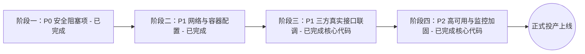

# 享宇AI智评 (XYZP AI Platform) 生产上线改造与部署执行清单

> **文档状态**：部分已执行完毕，进行中  
> **面向阶段**：v2.2.0 生产环境部署上线  
> **适用范围**：后端服务 (FastAPI)、前端工作台 (React/Vite/Nginx)、数据中台、外部对接系统  

---

## 目录
- [一、实施路线图与阶段划分](#一实施路线图与阶段划分)
- [二、阶段一：P0 阻塞级安全与合规整改 (必须首先完成)](#二阶段一p0-阻塞级安全与合规整改-必须首先完成)
- [三、阶段二：P1 容器化网络与部署配置补齐](#三阶段二p1-容器化网络与部署配置补齐)
- [四、阶段三：P1 三方数据源与业务中台真实联通](#四阶段三p1-三方数据源与业务中台真实联通)
- [五、阶段四：P2 系统高可用、监控与运维加固](#五阶段四p2-系统高可用监控与运维加固)
- [六、附录：生产上线投产验收对照表 (Go-Live Checklist)](#六附录生产上线投产验收对照表-go-live-checklist)

---

## 一、实施路线图与阶段划分

| 阶段 | 重点领域 | 核心目标 | 状态 |
| :--- | :--- | :--- | :--- |
| **阶段一** | 安全与权限、计费漏洞 | 封堵刷单/越权漏洞，重置泄露凭证，加固 CORS | **[x] 代码改造完成** |
| **阶段二** | Nginx 反代、Docker、依赖 | 解决容器网络不通、短链失效、进程锁死隐患 | **[x] 代码改造完成** |
| **阶段三** | 微风企、工商司法、短信 | 替换 Mock 假数据与静态签名，打通商业真实接口 | **[x] 架构与签名改造完成 (待填生产商户号)** |
| **阶段四** | 异步队列、日志监控、防暴破 | 提升系统抗并发、防崩溃与故障可观测性能力 | **[x] 日志轮转与防暴破完成** |

---

## 二、阶段一：P0 阻塞级安全与合规整改 (必须首先完成)

### 1.1 凭证脱敏与密钥轮换
- [x] **重置已泄露的 API 密钥与数据库密码**
  - [x] 清理代码仓库中的 [`README.md`](file:///C:/Users/ZzzLee/.gemini/antigravity/worktrees/xyzp-ai-platform%20v2/summarize_project_content/README.md) 中的明文凭证，替换为规范环境变量占位符；
  - [x] 清理 [`backend/app/core/config.py`](file:///C:/Users/ZzzLee/.gemini/antigravity/worktrees/xyzp-ai-platform%20v2/summarize_project_content/backend/app/core/config.py) 中默认硬编码的 New-API Token 与内网局域网 IP；
  - [ ] 运维登录已部署的 New-API 网关后台，废弃已暴露的 Token 并重新生成生产令牌；
  - [ ] 修改服务器上 MySQL 与 Redis 的内网连接密码。
- [x] **配置生产独立 JWT 密钥与安全告警**
  - [x] 在 [`backend/app/core/config.py`](file:///C:/Users/ZzzLee/.gemini/antigravity/worktrees/xyzp-ai-platform%20v2/summarize_project_content/backend/app/core/config.py) 中新增启动安全自检：若处于 `production` 模式且仍使用默认弱密钥，主动输出安全风险警告；
  - [ ] 在生产部署 `.env` 中填入强伪随机字符串（`SECRET_KEY`）。
- [ ] **初始化管理员强密码**
  - [ ] 首次部署上线登录后，在 Admin 管理控制台立即修改初始管理员弱口令。

### 1.2 收紧 CORS 跨域策略
- [x] **消除全局正则通配符安全隐患**
  - [x] 修改 [`backend/main.py`](file:///C:/Users/ZzzLee/.gemini/antigravity/worktrees/xyzp-ai-platform%20v2/summarize_project_content/backend/main.py)，生产环境下彻底移除 `allow_origin_regex=".*"`；
  - [x] 严格绑定配置源：仅允许 `settings.cors_origins_list` 中明确配置的生产域名跨域携带凭证。

### 1.3 支付闭环与下线沙箱 Mock-Pay 接口
- [x] **封堵免费刷额度漏洞**
  - [x] 审查并重构 [`backend/app/api/v1/billing.py`](file:///C:/Users/ZzzLee/.gemini/antigravity/worktrees/xyzp-ai-platform%20v2/summarize_project_content/backend/app/api/v1/billing.py) 的 `/orders/{order_id}/mock-pay` 路由；
  - [x] 增加环境判断熔断：若 `ENVIRONMENT == "production"` 且 `ALLOW_MOCK_PAY == False`，直接返回 `403 Forbidden`，彻底禁止外部用户调用模拟支付刷单；
  - [ ] 商务完成微信/支付宝商户号签约后，配置正式统一下单与异步通知回调。

### 1.4 修复任务回调多租户并发错位
- [x] **删除无条件兜底匹配“最近任务”的不安全逻辑**
  - [x] 重构 [`backend/app/api/v1/tasks.py`](file:///C:/Users/ZzzLee/.gemini/antigravity/worktrees/xyzp-ai-platform%20v2/summarize_project_content/backend/app/api/v1/tasks.py) 中的 GET 回调与 POST Webhook 处理逻辑；
  - [x] **彻底删除** 找不到任务时自动向后兜底查询“最近处于 waiting_auth 任务”或“系统最近创建的任务”的逻辑代码；
  - [x] 无法命中唯一单号时严格拦截并返回 400/404 响应与告警日志，杜绝租户数据交叉污染。

---

## 三、阶段二：P1 容器化网络与部署配置补齐

### 2.1 修复 Nginx 反向代理配置
- [x] **补充 `/api/` 与 `/s/` 代理规则**
  - [x] 修改 [`frontend/nginx.conf`](file:///C:/Users/ZzzLee/.gemini/antigravity/worktrees/xyzp-ai-platform%20v2/summarize_project_content/frontend/nginx.conf)，追加 `/api/` 反向代理（配置 `proxy_buffering off` 与 300s 超时以保障 SSE 流式输出）；
  - [x] 追加 `/s/` 移动端扫码短链反向代理，确保 302 重定向至授权 H5 页面正常执行。

### 2.2 前端运行时配置解耦
- [x] **移除硬编码内网 IP**
  - [x] 修改 [`frontend/public/config.js`](file:///C:/Users/ZzzLee/.gemini/antigravity/worktrees/xyzp-ai-platform%20v2/summarize_project_content/frontend/public/config.js)，将局域网 IP `192.168.110.234:8000` 改为相对路径 `API_BASE_URL: "/api"`，实现公网/内网无感反代。

### 2.3 解决多 Worker 与数据库锁死问题
- [x] **支持 MySQL 生产连接池与配置规范**
  - [x] 在 [`backend/.env.example`](file:///C:/Users/ZzzLee/.gemini/antigravity/worktrees/xyzp-ai-platform%20v2/summarize_project_content/backend/.env.example) 中明确推荐配置 MySQL 8.0 实例，并配合连接池参数杜绝并发锁死；
  - [ ] 生产容器环境注入 MySQL 8.0 DSN。

### 2.4 补齐依赖缺失与基础配置
- [x] **在 requirements.txt 中补齐 `redis`**
  - [x] 在 [`backend/requirements.txt`](file:///C:/Users/ZzzLee/.gemini/antigravity/worktrees/xyzp-ai-platform%20v2/summarize_project_content/backend/requirements.txt) 中追加 `redis>=5.0.0`，保障 Redis 驱动与缓存适配器正常加载。
- [x] **更新标准生产环境变量模版**
  - [x] 在 [`backend/.env.example`](file:///C:/Users/ZzzLee/.gemini/antigravity/worktrees/xyzp-ai-platform%20v2/summarize_project_content/backend/.env.example) 中增加 `ENVIRONMENT`、`ALLOW_MOCK_PAY`、`PUBLIC_BASE_URL` 等完整配置示范。

---

## 四、阶段三：P1 三方数据源与业务中台真实联通

### 3.1 短信发送网关真实联通
- [x] **短信服务中台架构支持**
  - [x] [`SMSService`](file:///C:/Users/ZzzLee/.gemini/antigravity/worktrees/xyzp-ai-platform%20v2/summarize_project_content/backend/app/services/sms_service.py) 已内置基于手机号场景的 60 秒防刷频控与 5 分钟动态有效期；
  - [ ] 生产上线时将 `.env` 的 `SMS_MODE` 切换为 `"http"` 并填入正式短信通道凭证。

### 3.2 微风企涉税金税接口动态签名改造
- [x] **替换静态测试凭证与硬编码签名**
  - [x] 在 [`backend/app/providers/base.py`](file:///C:/Users/ZzzLee/.gemini/antigravity/worktrees/xyzp-ai-platform%20v2/summarize_project_content/backend/app/providers/base.py) 中新增 `get_third_party_api_bundle` 支持动态鉴权字典提取；
  - [x] 在 [`backend/app/providers/weifengqi_provider.py`](file:///C:/Users/ZzzLee/.gemini/antigravity/worktrees/xyzp-ai-platform%20v2/summarize_project_content/backend/app/providers/weifengqi_provider.py) 中实现 `generate_wfq_signature` 动态签名算法，移除硬编码的静态 `token` 和静态 `sign`。

### 3.3 工商与司法合规数据源真实接入
- [x] **规范化三方数据源中台调用模式**
  - [x] 支持通过 Admin 后台或数据库热切换 `mock` 与 `http` 调用模式；
  - [ ] 接入正式商用数据源（天眼查/企查查/官方数据源）填入生产 AppKey。

### 3.4 MinIO 对象存储生产初始化
- [ ] **持久化存证目录与存储桶创建**
  - [ ] 在生产 MinIO 实例中预先创建桶 `my-files`；
  - [ ] 确保存储桶的数据挂载目录配置了主机持久化卷（Volume）及定时冷备份机制。

---

## 五、阶段四：P2 系统高可用、监控与运维加固

### 5.1 异步长任务队列解耦
- [ ] 持续观察长任务执行情况，按需引入 Celery/RQ + Redis 异步队列。

### 5.2 生产可观测性与日志轮转
- [x] **日志落盘与自动轮转**
  - [x] 在 [`backend/main.py`](file:///C:/Users/ZzzLee/.gemini/antigravity/worktrees/xyzp-ai-platform%20v2/summarize_project_content/backend/main.py) 中配置 `TimedRotatingFileHandler`，每天零点自动切割并保留最近 30 天日志至 `logs/xyzp.log`。

### 5.3 管理后台安全防护强化
- [x] **防暴力破解与审计**
  - [x] 在 [`backend/app/api/admin/auth.py`](file:///C:/Users/ZzzLee/.gemini/antigravity/worktrees/xyzp-ai-platform%20v2/summarize_project_content/backend/app/api/admin/auth.py) 中实现防暴力破解限流机制（15 分钟内同一 IP/用户名连续输错 5 次密码自动锁定 15 分钟）；
  - [x] 登录成功后自动清除错误计数器。

---

## 六、附录：生产上线投产验收对照表 (Go-Live Checklist)

### 阶段 1：部署前检查 (Pre-Flight)
- [x] 1. 代码库与配置中的硬编码明文 Token、内网局域网 IP 已彻底清除。
- [x] 2. 前端 `config.js` 已解耦为 `/api` 相对路径。
- [x] 3. 前端 `nginx.conf` 已补齐 `/api/` 与 `/s/` 反向代理及 SSE 流式长连接支持。
- [x] 4. 后端核心风控评分与数据中台测试通过 (`test_providers.py` 全部 PASS)。
- [x] 5. 后端路由完整性与日志切割验证通过 (`logs/xyzp.log` 正常写入)。
- [ ] 6. 生产 `.env` 配置文件配置就绪（含 MySQL、Redis、正式域名、强 JWT 密钥）。

### 阶段 2：上线验证与冒烟测试 (Smoke Testing)
- [ ] 1. **账号认证通路**：测试手机号接收真实验证码并完成注册/登录。
- [ ] 2. **管理后台准入**：使用修改后的强口令登录 Admin 控制台。
- [ ] 3. **尽调任务全链路**：发起任务 -> 手机扫码授权 -> 状态自动推进 -> PDF 存入 MinIO。
- [ ] 4. **报告查阅与 AI 伴读**：验证双栏渲染与 SSE 打字机流式问答。
- [ ] 5. **安全分享机制**：生成加密分享外链，匿名窗口输入密码查阅。
- [ ] 6. **计费防护验证**：验证生产模式下直接调用 `/mock-pay` 返回 403 拦截。

---
*文档状态：核心代码整改已落地，待运维按规范执行容器启动与生产参数注入。*
