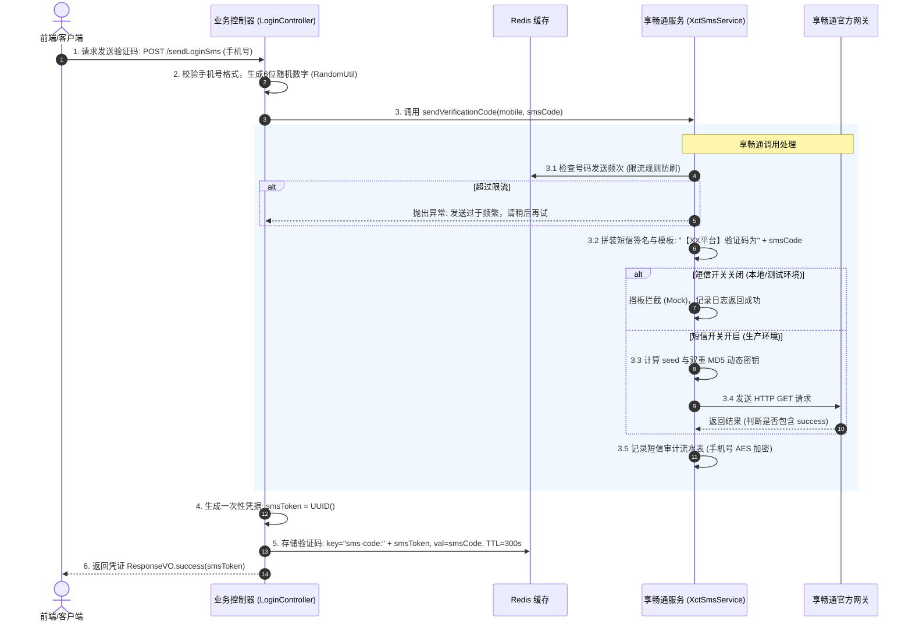
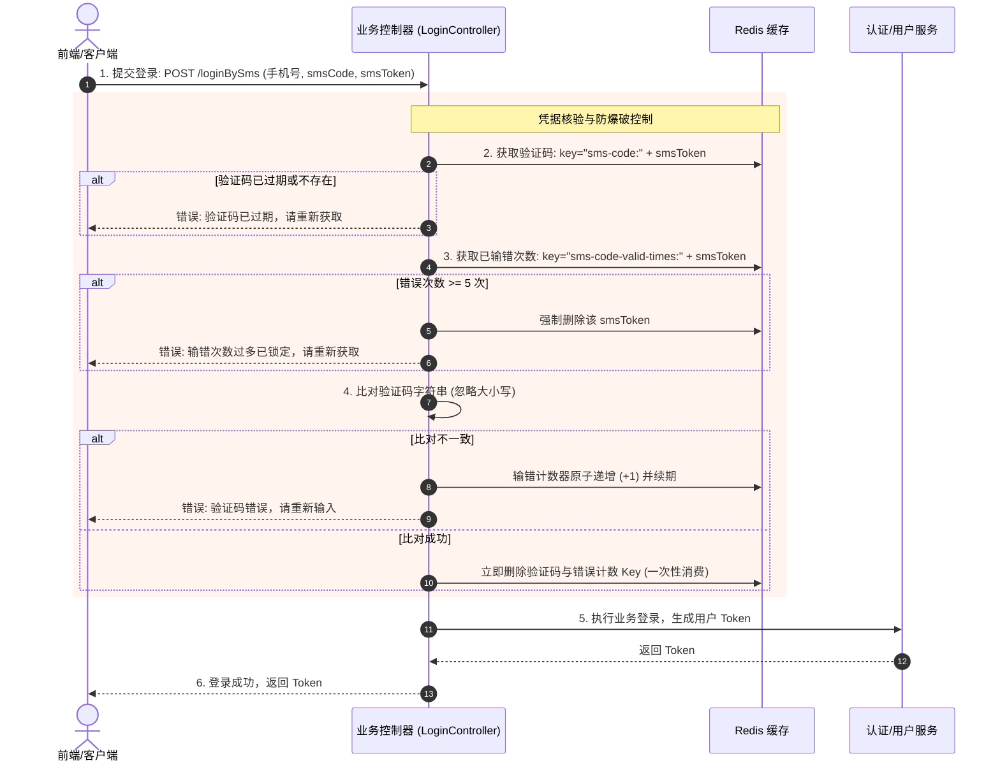

# 享畅通短信发送与验证码服务实现方案

> 本文档专为对接**享畅通短信平台**（XCT SMS）量身定制，涵盖接口协议规范、加盐签名算法、验证码防刷与防爆破全流程、数据表与缓存设计，以及在新项目中开箱即用的完整代码范式。

---

## 1. 方案概述与架构设计

本方案提供基于**享畅通短信网关**的完整验证码与消息通知实现，核心涵盖两大业务场景：
1. **身份凭证类验证码**：用户注册、验证码登录、修改/找回密码、关键操作二次确认。
2. **业务通知类短信**：审核结果通知、订单流转、系统预警通知。

### 1.1 总体架构与调用拓扑

```
+-------------------------------------------------------------------------+
|                  客户端层 (Portal Web / Mobile App / 小程序)              |
+-------------------------------------------------------------------------+
                                    |
                                    | HTTPS 请求 (包含手机号 / smsToken 凭证)
                                    v
+-------------------------------------------------------------------------+
|                    应用层控制器 (Login / AuthController)                 |
|  - 敏感参数掩码打标                                                        |
|  - 生成6位数字验证码                                                       |
|  - 生成 smsToken 凭证并写入 Redis (300秒有效)                               |
|  - 校验验证码 (防暴力破解输错5次锁定，比对成功即作废)                          |
+-------------------------------------------------------------------------+
                                    |
                                    | 调用短信服务
                                    v
+-------------------------------------------------------------------------+
|                    短信核心服务 (XctSmsService)                          |
|  - 环境开关判定 (开发测试环境挡板拦截 Mock / 生产环境真实发送)                 |
|  - 号码防刷频次限流 (单位时间限制最大发送次数)                                 |
|  - 模板占位符解析 (${validCode}) 与平台报备签名拼接 (【XX平台】)             |
|  - 记录短信流水日志 (手机号 AES 密文存储 + 掩码展示)                          |
+-------------------------------------------------------------------------+
                                    |
                                    | HTTP GET 请求 (URL 参数鉴权)
                                    v
+-------------------------------------------------------------------------+
|                       享畅通短信平台网关                                  |
|  - 验证 name (账号)                                                      |
|  - 验证时间戳加盐签名: MD5(MD5(key) + seed)                               |
|  - 发送短信到目标运营商基站                                                |
+-------------------------------------------------------------------------+
```

---

## 2. 享畅通接口协议与鉴权算法详解

享畅通采用轻量级 `HTTP GET` 协议，所有参数通过 URL Query 传递，其安全性主要依赖**基于时间戳的动态加盐双重 MD5 哈希**。

### 2.1 请求规范

- **请求方式**：`HTTP GET`
- **请求编码**：`UTF-8`
- **基础 URL**：由享畅通服务商提供（例如：`http://api.xct.com/sms/send`）

### 2.2 请求参数说明

| 参数名 | 类型 | 必填 | 描述 | 示例值 |
| :--- | :--- | :--- | :--- | :--- |
| `name` | String | 是 | 享畅通分配的商户账号/用户名 | `xy_tenant_01` |
| `seed` | String | 是 | 动态时间戳盐值，格式必须为 `yyyyMMddHHmmss` | `20260910113000` |
| `key` | String | 是 | 鉴权动态签名串（双重 MD5 结果） | `e10adc3949ba59abbe56e057f20f883e` |
| `dest` | String | 是 | 目标手机号，支持群发（多个号码用英文逗号分隔） | `13800138000` 或 `138...,139...` |
| `content` | String | 是 | 短信内容（必须含已报备签名），需进行 **UTF-8 URL 编码** | `【享宇金融】验证码为123456...` |

---

### 2.3 核心签名计算算法（双重 MD5 + 时间戳盐）

享畅通的核心防篡改与防重放机制如下：
1. 取当前系统时间，格式化为 `yyyyMMddHHmmss`，记为 `seed`。
2. 将服务商分配的商户密钥明文 `key` 进行第一次 32 位小写 MD5：
   $$\text{md5Key} = \text{MD5}(key).\text{toLowerCase()}$$
3. 将一阶段哈希值与 `seed` 拼接，再进行第二次 32 位小写 MD5 计算：
   $$\text{signKey} = \text{MD5}(\text{md5Key} + seed).\text{toLowerCase()}$$
4. 最终组装的请求 URL：
   ```
   {url}?name={name}&seed={seed}&key={signKey}&dest={dest}&content={URLEncoder.encode(content, "UTF-8")}
   ```

> **算法核心优势**：每次请求的 `seed` 随时间变化，计算出来的 `key` 具有时效性且每次不同，可有效抵御网络重放攻击，且无需在网络上传输密钥明文。

---

### 2.4 响应结果判断

享畅通接口执行成功后，通常返回包含字符串或 JSON 格式的报文。
- **成功判定**：响应文本中包含 `"success"`（例如：`{"code": 0, "msg": "success"}` 或纯文本 `success`）。
- **失败处理**：若不包含 `"success"`，则视为发送失败，记录失败原因并抛出业务异常。

---

## 3. 业务全流程设计（发送与核验）

### 3.1 验证码发送阶段



---

### 3.2 验证码核验登录阶段（防暴力破解）



---

## 4. 开箱即用核心代码实现

本节提供无需复杂三方框架、基于 Spring Boot 标准环境即可直接运行的代码。

### 4.1 配置文件（`application.yml`）

```yaml
# 享畅通短信对接配置
xct:
  sms:
    # 享畅通网关地址
    url: http://api.xct.com/sms/send
    # 享畅通商户账号
    name: your_merchant_name
    # 享畅通商户密钥
    key: your_merchant_key
    # 平台报备签名 (短信内容必须带签名)
    sign: 享宇智运
    # 是否开启真实短信发送 (开发/测试环境置为 false 开启挡板)
    is-open: true
    # 验证码有效时长 (秒)
    expire-seconds: 300
    # 最大允许输错次数
    max-error-count: 5
```

---

### 4.2 享畅通专用发送工具类（`XctSmsSender.java`）

采用 Java 11+ 原生 `HttpClient`（轻量、无需引入额外 HTTP 框架，也可使用 Spring 的 `RestTemplate`）：

```java
package com.example.sms.sender;

import lombok.extern.slf4j.Slf4j;
import org.apache.commons.codec.digest.DigestUtils;
import org.springframework.beans.factory.annotation.Value;
import org.springframework.stereotype.Component;

import java.net.URI;
import java.net.URLEncoder;
import java.net.http.HttpClient;
import java.net.http.HttpRequest;
import java.net.http.HttpResponse;
import java.nio.charset.StandardCharsets;
import java.time.Duration;
import java.time.LocalDateTime;
import java.time.format.DateTimeFormatter;

@Slf4j
@Component
public class XctSmsSender {

    @Value("${xct.sms.url}")
    private String url;

    @Value("${xct.sms.name}")
    private String name;

    @Value("${xct.sms.key}")
    private String key;

    @Value("${xct.sms.is-open:true}")
    private boolean isOpen;

    private static final DateTimeFormatter TIME_FORMATTER = DateTimeFormatter.ofPattern("yyyyMMddHHmmss");
    private final HttpClient httpClient = HttpClient.newBuilder()
            .connectTimeout(Duration.ofSeconds(5))
            .build();

    /**
     * 发送短信到享畅通平台
     *
     * @param mobiles 手机号，群发多个以逗号隔开
     * @param content 完整的短信文本（已包含【签名】）
     * @return true-成功, false-失败
     */
    public boolean sendSms(String mobiles, String content) {
        // 1. 开关检查（挡板机制）
        if (!isOpen) {
            log.info("[享畅通短信-挡板拦截] 模拟发送成功 -> 接收号码: {}, 短信内容: {}", mobiles, content);
            return true;
        }

        try {
            // 2. 生成当前时间戳 seed
            String seed = LocalDateTime.now().format(TIME_FORMATTER);

            // 3. 计算双重 MD5 签名: md5(md5(key) + seed)
            String firstMd5 = DigestUtils.md5Hex(key).toLowerCase();
            String signKey = DigestUtils.md5Hex(firstMd5 + seed).toLowerCase();

            // 4. URL 编码短信内容
            String encodedContent = URLEncoder.encode(content, StandardCharsets.UTF_8);

            // 5. 组装请求 URL
            String fullUrl = String.format("%s?name=%s&seed=%s&key=%s&dest=%s&content=%s",
                    url, name, seed, signKey, mobiles, encodedContent);

            log.debug("[享畅通短信] 发起请求: name={}, seed={}, dest={}", name, seed, mobiles);

            // 6. 发起 HTTP GET 请求
            HttpRequest request = HttpRequest.newBuilder()
                    .uri(URI.create(fullUrl))
                    .timeout(Duration.ofSeconds(10))
                    .GET()
                    .build();

            HttpResponse<String> response = httpClient.send(request, HttpResponse.BodyHandlers.ofString());
            String responseBody = response.body();

            log.info("[享畅通短信] 网关响应: statusCode={}, body={}", response.statusCode(), responseBody);

            // 7. 判断结果是否包含 success
            if (responseBody != null && responseBody.contains("success")) {
                return true;
            } else {
                log.error("[享畅通短信] 发送失败，接口响应: {}", responseBody);
                return false;
            }
        } catch (Exception e) {
            log.error("[享畅通短信] 发送异常，目标号码: {}", mobiles, e);
            throw new RuntimeException("享畅通短信接口调用失败: " + e.getMessage());
        }
    }
}
```

---

### 4.3 验证码业务编排服务（`SmsVerificationService.java`）

```java
package com.example.sms.service;

import com.example.sms.sender.XctSmsSender;
import lombok.extern.slf4j.Slf4j;
import org.springframework.beans.factory.annotation.Autowired;
import org.springframework.beans.factory.annotation.Value;
import org.springframework.data.redis.core.StringRedisTemplate;
import org.springframework.stereotype.Service;

import java.time.Duration;
import java.util.UUID;
import java.util.concurrent.ThreadLocalRandom;

@Slf4j
@Service
public class SmsVerificationService {

    @Autowired
    private StringRedisTemplate redisTemplate;

    @Autowired
    private XctSmsSender xctSmsSender;

    @Value("${xct.sms.sign:享宇智运}")
    private String sign;

    @Value("${xct.sms.expire-seconds:300}")
    private int expireSeconds;

    @Value("${xct.sms.max-error-count:5}")
    private int maxErrorCount;

    private static final String SMS_CODE_PREFIX = "sms-code:";
    private static final String SMS_TIMES_PREFIX = "sms-code-valid-times:";
    private static final String RATE_LIMIT_PREFIX = "sms-rate-limit:";

    /**
     * 发送登录短信验证码
     *
     * @param mobile 手机号
     * @return 业务凭据 smsToken
     */
    public String sendLoginSms(String mobile) {
        // 1. 号码限流检查（例如：1分钟内同一手机号只能发1次）
        String rateKey = RATE_LIMIT_PREFIX + mobile;
        Boolean isAllowed = redisTemplate.opsForValue().setIfAbsent(rateKey, "1", Duration.ofSeconds(60));
        if (Boolean.FALSE.equals(isAllowed)) {
            throw new RuntimeException("验证码获取过于频繁，请稍后再试");
        }

        // 2. 生成6位随机验证码
        String code = String.valueOf(ThreadLocalRandom.current().nextInt(100000, 999999));

        // 3. 拼装符合享畅通规范的短信（【签名】+ 模板正文）
        String smsContent = String.format("【%s】您正在登录系统，验证码为%s，%d分钟内有效，请勿泄露给他人。",
                sign, code, expireSeconds / 60);

        // 4. 调用享畅通网关发送
        boolean sendOk = xctSmsSender.sendSms(mobile, smsContent);
        if (!sendOk) {
            redisTemplate.delete(rateKey); // 发送失败解除频控
            throw new RuntimeException("短信发送失败，请稍后重试");
        }

        // 5. 生成无状态凭证 smsToken，存入 Redis
        String smsToken = UUID.randomUUID().toString().replace("-", "");
        String codeKey = SMS_CODE_PREFIX + smsToken;
        redisTemplate.opsForValue().set(codeKey, code, Duration.ofSeconds(expireSeconds));

        // 6. 返回凭据给前端，前端不能直接获知验证码明文
        return smsToken;
    }

    /**
     * 核验短信验证码（带防暴力破解）
     *
     * @param smsToken  客户端提交的凭据
     * @param inputCode 客户端输入的验证码
     */
    public void verifySmsCode(String smsToken, String inputCode) {
        String codeKey = SMS_CODE_PREFIX + smsToken;
        String timesKey = SMS_TIMES_PREFIX + smsToken;

        // 1. 读取已存验证码
        String realCode = redisTemplate.opsForValue().get(codeKey);
        if (realCode == null) {
            throw new RuntimeException("短信验证码已过期或不存在，请重新获取");
        }

        // 2. 校验错误次数上限
        String timesStr = redisTemplate.opsForValue().get(timesKey);
        long errorTimes = timesStr == null ? 0 : Long.parseLong(timesStr);
        if (errorTimes >= maxErrorCount) {
            redisTemplate.delete(codeKey); // 超过上限强制作废
            throw new RuntimeException("验证码输错次数超过上限，已作废，请重新获取");
        }

        // 3. 一致性比对
        if (!realCode.equalsIgnoreCase(inputCode)) {
            // 递增错误次数
            redisTemplate.opsForValue().increment(timesKey);
            redisTemplate.expire(timesKey, Duration.ofSeconds(expireSeconds));
            throw new RuntimeException("短信验证码错误，请重新输入");
        }

        // 4. 核验成功：立即删除验证码与计数器，防止重放攻击
        redisTemplate.delete(codeKey);
        redisTemplate.delete(timesKey);
    }
}
```

---

### 4.4 控制器示例（`AuthController.java`）

```java
package com.example.sms.controller;

import com.example.sms.service.SmsVerificationService;
import lombok.Data;
import org.springframework.beans.factory.annotation.Autowired;
import org.springframework.validation.annotation.Validated;
import org.springframework.web.bind.annotation.*;

import java.util.Map;

@RestController
@RequestMapping("/api/auth")
public class AuthController {

    @Autowired
    private SmsVerificationService smsVerificationService;

    /**
     * 接口1：获取登录验证码
     */
    @PostMapping("/sendLoginSms")
    public Map<String, Object> sendLoginSms(@RequestBody @Validated SendSmsReq req) {
        // 调用发送，获取 smsToken
        String smsToken = smsVerificationService.sendLoginSms(req.getMobile());
        return Map.of("code", 200, "message", "发送成功", "data", smsToken);
    }

    /**
     * 接口2：短信验证码登录
     */
    @PostMapping("/loginBySms")
    public Map<String, Object> loginBySms(@RequestBody @Validated SmsLoginReq req) {
        // 1. 核验证码有效性
        smsVerificationService.verifySmsCode(req.getSmsToken(), req.getSmsCode());

        // 2. 执行业务登录，颁发鉴权 Token
        String userToken = "JWT_TOKEN_FOR_" + req.getMobile();
        return Map.of("code", 200, "message", "登录成功", "data", Map.of("token", userToken));
    }

    @Data
    public static class SendSmsReq {
        private String mobile;
    }

    @Data
    public static class SmsLoginReq {
        private String mobile;
        private String smsCode;
        private String smsToken;
    }
}
```

---

## 5. 数据库设计与 Redis 规范

### 5.1 短信发送日志流水表 (`xct_sms_log`)

用于生产对账、异常排查与合规审计：

```sql
CREATE TABLE `xct_sms_log` (
  `id` BIGINT NOT NULL AUTO_INCREMENT COMMENT '自增主键',
  `biz_no` VARCHAR(64) DEFAULT NULL COMMENT '关联业务单号/操作单号',
  `mobile` VARCHAR(255) NOT NULL COMMENT '手机号 (AES 密文加密存储)',
  `mobile_des` VARCHAR(32) NOT NULL COMMENT '手机号脱敏掩码 (138****0000)',
  `content` VARCHAR(500) NOT NULL COMMENT '发送短信完整内容',
  `state` TINYINT NOT NULL DEFAULT 1 COMMENT '状态: 1-成功, 0-失败',
  `remark` VARCHAR(255) DEFAULT NULL COMMENT '失败原因或标识 (如 [挡板拦截])',
  `request_time` DATETIME NOT NULL COMMENT '请求时间',
  `response_time` DATETIME DEFAULT NULL COMMENT '响应时间',
  `use_time` BIGINT DEFAULT NULL COMMENT '耗时 (毫秒)',
  PRIMARY KEY (`id`),
  KEY `idx_biz_no` (`biz_no`),
  KEY `idx_request_time` (`request_time`)
) ENGINE=InnoDB DEFAULT CHARSET=utf8mb4 COMMENT='享畅通短信发送流水表';
```

---

### 5.2 Redis 缓存 Key 设计与 TTL 策略

| Redis Key | 类型 | 建议 TTL | 业务用途说明 |
| :--- | :--- | :--- | :--- |
| `sms-code:{smsToken}` | String | 300 秒 (5分钟) | 存放当前凭据对应的 6 位数字验证码，比对成功即删除 |
| `sms-code-valid-times:{smsToken}` | String (数字) | 300 秒 (5分钟) | 记录当前凭据输入错误次数，达到 5 次强制使验证码失效 |
| `sms-rate-limit:{mobile}` | String | 60 秒 (1分钟) | 同一手机号发送频控，防止短时间连续点击触发多次发送 |

---

## 6. 享畅通上线自查与常见问题排查手册

### 6.1 生产上线前安全自查清单
- [ ] **签名报备一致性**：确认 `xct.sms.sign` 与享畅通后台已报备通过的签名文字严格一致（包含中英文括号）。
- [ ] **URL 参数转义**：短信内容 `content` 必须经由 `URLEncoder.encode(content, "UTF-8")` 处理，避免空格或特殊标点导致 GET URL 解析截断。
- [ ] **手机号加密合规**：生产数据库中严禁裸存手机号，入库一律使用 AES-128 加密，业务日志仅打印 `SensitiveMaskUtil.maskMobile(mobile)`。
- [ ] **开发测试挡板**：在本地开发及测试服务器中，将 `xct.sms.is-open: false`，避免开发调试阶段消耗实际短信条数。

### 6.2 常见错误与排查方案

| 现象 / 报错信息 | 原因分析 | 解决方案 |
| :--- | :--- | :--- |
| **享畅通返回鉴权失败 / 签名错误** | 时间戳 `seed` 格式不正确，或双重 MD5 计算有误 | 1. 确认时间格式为 `yyyyMMddHHmmss`。<br>2. 确认第一层和第二层 MD5 均转换为**全小写**。<br>3. 检查服务器时钟是否同步（偏差不得过大）。 |
| **短信接收到乱码或内容不全** | GET 请求未进行正确的 UTF-8 编码 | 短信文本必须使用 `URLEncoder.encode(content, StandardCharsets.UTF_8)`。 |
| **日志记录为 `[享畅通短信-挡板拦截]`** | 配置文件中 `is-open` 处于 `false` 状态 | 若为生产环境需发真实短信，请将 `xct.sms.is-open` 设置为 `true`。 |
| **提示“验证码输错次数超过上限”** | 连续输错达到最大阈值（5次） | 此为正常的防撞库保护机制，指导用户重新获取验证码。 |
| **提示“验证码获取过于频繁”** | 触发了 60 秒频控 Key | 提示用户等待 60 秒后再重试，防止短信轰炸。 |


### 6.3 短信模版
您正在进行登录操作，验证码为：${validCode}，5分钟内有效，请勿向他人泄露。如非本人操作，请忽略！
您正在进行找回密码操作，验证码为：${validCode}，5分钟内有效，请勿向他人泄露。如非本人操作，请忽略！
您正在进行修改密码操作，验证码为：${validCode}，5分钟内有效，请勿向他人泄露。如非本人操作，请忽略！
您正在进行注册账号操作，验证码为：${validCode}，5分钟内有效，请勿向他人泄露。如非本人操作，请忽略！